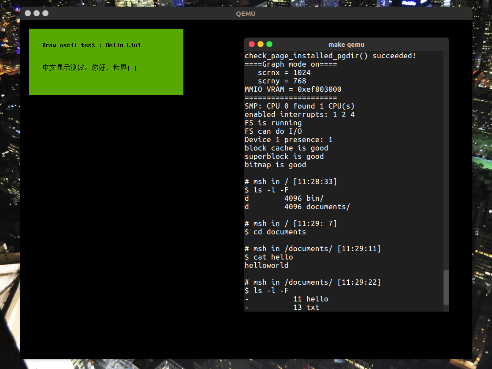

# JOS




## 关于

[MIT 6.828 website](https://pdos.csail.mit.edu/6.828/2016/)

本项目在完成`JOS`的基础上实现一些有趣的东西。

记录文档见`./lab_record`


## 完成列表

- [x] lab1 Booting a PC
- [x] lab1 challenge: VGA GUI
- [x] lab2 Memory Management
- [x] lab2 challenge
- [x] lab3 User Environments
- [x] lab3 challenge: single step debug
- [x] lab4 Preemptive Multitasking
- [ ] lab4 challenge
- [x] Lab 5: File system, Spawn and Shell
- [ ] lab5 challenge


## 实验中已支持的特性

- 段页式内存管理 （详见`\lab_record\lab2.md`）
- 支持进程(`Environments`)
  - 进程切换
  - 进程间通讯，通过`syscall`实现
  - 进程单独地址空间
  - `spawn`创建进程，`fork`使用`Read Copy Update`策略
  - 支持抢断式任务调度
- 支持多核`CPU`
  - 支持`IPI`，提供`IPI`接口
  - 支持大内核锁（基于自旋锁）
- 系统服务`syscall`
  - 打印字符
  - 获取字符
  - 获取进程编号
  - 回收进程
  - 主动调度
  - `fork`
  - 设置进程状态
  - 申请页，映射页，取消映射
  - **用户空间页错误处理入口设置**
  - `IPC`进程间通讯
  - 用户空间异常处理栈设置
- 支持页错误用户空间处理
- 支持简易文件系统 （CS结构）
- 支持文件描述符
- 支持`pipe`
- 用户空间工具
  - `sh`简易`shell`

  ​


## 新特性

- 支持原子操作
- 支持读写锁
- 支持针对单一核心`IPI`
- 支持`PRWLock`
- 支持基本图形显示
- 支持中英文显示（中英文点阵字库）
- 支持进程工作目录 提供`getcwd`与`chdir`
- 新的`syscall`

  - `SYS_env_set_workpath` 修改工作路径
- 新的用户程序

  - `ls` 功能完善
  - `pwd` 输出当前工作目录
  - `cat` 接入工作目录
  - `touch` 由于文件属性没啥可改的，用于创建文件
  - `mkdir` 创建目录文件
  - `msh` 更高级的`shell` 还未完全完工 支持`cd` 支持默认二进制路径为 `bin`
- 调整目标磁盘生成工具
- 支持从RTC读取时间
- 支持`kmalloc/kfree`，支持分配连续空间


```c
# msh in / [12:14:28]
$ cd documents

# msh in /documents/ [12:14:35]
$ echo hello liu > hello

# msh in /documents/ [12:14:45]
$ cat hello
hello liu

# msh in /documents/ [12:14:49]
$ cd /bin

# msh in /bin/ [12:14:54]
$ ls -l -F
-          37 newmotd
-          92 motd
-         447 lorem
-         132 script
-        2916 testshell.key
-         113 testshell.sh
-       20308 cat
-       20076 echo
-       20508 ls
-       20332 lsfd
-       25060 sh
-       20076 hello
-       20276 pwd
-       20276 mkdir
-       20280 touch
-       29208 msh

# msh in /bin/ [12:14:57]
$ 
```

## 计划完成的特性

- MSH 功能更全的`shell`

- `lab challenge`