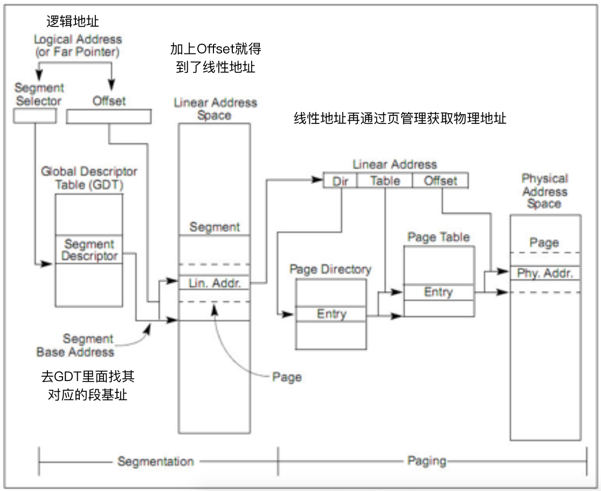

# lab2 Memory Management

## Part1: Physical Page Management

在初始化的时候利用下面的函数进行分配空间

```c
static void *
boot_alloc(uint32_t n)
{
	static char *nextfree; // virtual address of next byte of free memory
	char *result;

	// Initialize nextfree if this is the first time.
	// 'end' is a magic symbol automatically generated by the linker,
	// which points to the end of the kernel's bss segment:
	// the first virtual address that the linker did *not* assign
	// to any kernel code or global variables.
	if (!nextfree)
	{
		extern char end[];
		nextfree = ROUNDUP((char *)end, PGSIZE);
		// it will panic if out of memory
	}

	// Allocate a chunk large enough to hold 'n' bytes, then update
	// nextfree.  Make sure nextfree is kept aligned
	// to a multiple of PGSIZE.
	//
	// If n==0, returns the address of the next free page without allocating
	// anything.
	if (!n)
		return nextfree;
	// If n>0, allocates enough pages of contiguous physical memory to hold 'n'
	// bytes.  Doesn't initialize the memory.  Returns a kernel virtual address.
	else if (n > 0)
	{
		result = nextfree;
		// nextfree = ROUNDUP(nextfree+n,PGSIZE);
		nextfree = KADDR(PADDR(ROUNDUP((char *)nextfree + n, PGSIZE)));
		return result;
	}
	return NULL;
}
```

### 初始化页信息表

```c
void page_init(void)
{
	// free pages!
	size_t i = 0;
	char *first_free_page;
	pages[i].pp_ref = 1;
	for (i = 1; i < npages_basemem; i++)
	{
		pages[i].pp_ref = 0;
		pages[i].pp_link = page_free_list;
		page_free_list = &pages[i];
	}

	for (; i < PGNUM(EXTPHYSMEM); i++)
	{
		pages[i].pp_ref = 0;
		pages[i].pp_link = NULL;
	}
	//  4) Then extended memory [EXTPHYSMEM, ...).
	//     Some of it is in use, some is free.
	first_free_page = (char *)boot_alloc(0);
	for (; i < PGNUM(PADDR(first_free_page)); i++)
	{
		pages[i].pp_ref = 1;
		pages[i].pp_link = NULL;
	}
	for (; i < npages; i++)
	{
		pages[i].pp_ref = 0;
		pages[i].pp_link = page_free_list;
		page_free_list = &pages[i];
	}
}
```

其中要注意第四部分，为了判断是否已经被使用了，可以利用上面写的`boot_init`，来查找第一个没有被使用的页。然后在根据是否被使用来初始化页表。

### 分配页

分配页需要通过`page_free_list`获取空闲页表，并分配第一个页给当前需要获取的函数。更新空闲页表的入口。

```c
struct PageInfo *
page_alloc(int alloc_flags)
{
	struct PageInfo *pp;
	if (page_free_list == NULL)
		return NULL;
	if (alloc_flags & ALLOC_ZERO)
		memset(page2kva(page_free_list), 0, PGSIZE);
	pp = page_free_list;
	page_free_list = page_free_list->pp_link;
	pp->pp_link = NULL;
	return pp;
}
```

### 释放页

释放页则直接将这个页加入到空闲页表。

```c
void page_free(struct PageInfo *pp)
{
	// Fill this function in
	// Hint: You may want to panic if pp->pp_ref is nonzero or
	// pp->pp_link is not NULL.
	if (pp->pp_ref || pp->pp_link != NULL)
		panic("page_free error:pp->ref!=0 or pp->pp_link != NULL");
	pp->pp_link = page_free_list;
	page_free_list = pp;
}
```


## Part 2: Virtual Memory

> Table (GDT) that effectively disabled segment translation by setting all segment base addresses to 0 and limits to `0xffffffff`. Hence the "selector" has no effect and the linear address always equals the offset of the virtual address. 

所以在这里`va = la`

Assuming that the following JOS kernel code is correct, what type should variable `x` have, `uintptr_t` or `physaddr_t`?

```
	mystery_t x;
	char* value = return_a_pointer();
	*value = 10;
	x = (mystery_t) value;
```

`uintptr_t`

回顾`lab1`中的页表映射

```c
pde_t entry_pgdir[NPDENTRIES] = {
	// Map VA's [0, 4MB) to PA's [0, 4MB)
	[0]
		= ((uintptr_t)entry_pgtable - KERNBASE) + PTE_P,
	// Map VA's [KERNBASE, KERNBASE+4MB) to PA's [0, 4MB)
	[KERNBASE>>PDXSHIFT]
		= ((uintptr_t)entry_pgtable - KERNBASE) + PTE_P + PTE_W
};
```

对于一级页表中`[KERNBASE, KERNBASE+4MB)`，其的前`PDXSHIFT`位应为`KERNBASE>>PDXSHIFT`，故其二级页表的`pa = entry_pgtable - KERNBASE`

而`entry_pgtable`

```c
pte_t entry_pgtable[NPTENTRIES] = {
	0x000000 | PTE_P | PTE_W,
	0x001000 | PTE_P | PTE_W,
	0x002000 | PTE_P | PTE_W,
	...
}
```

则暴力对每个页进行了映射。

而我们现在的页表需要



```
// A linear address 'la' has a three-part structure as follows:
//
// +--------10------+-------10-------+---------12----------+
// | Page Directory |   Page Table   | Offset within Page  |
// |      Index     |      Index     |                     |
// +----------------+----------------+---------------------+
//  \--- PDX(la) --/ \--- PTX(la) --/ \---- PGOFF(la) ----/
//  \---------- PGNUM(la) ----------/
```

现在的虚拟地址空间的分布图如下：

 

其中`PageInfo`的部分是在`page_init`中进行的初始化。

`kern_pgdir`是在`mem_init`中直接分配的一页。

而二级页表`page_table`是在`page_walk`的时候分配，在`page_remov`的时候判断是否全部都已经分配完了，再释放。

理解了这些原理，书写代码很简单，其中值得关注的地方是`page_insert`

本来书写代码如下：

```c
int page_insert(pde_t *pgdir, struct PageInfo *pp, void *va, int perm)
{
	pte_t *pte = pgdir_walk(pgdir, va, 1);
	if (!pte)
		return -E_NO_MEM;
	// If there is already a page mapped at 'va', it should be page_remove()
	// The TLB must be invalidated if a page was formerly present at 'va' (in page_remove())
	if (*pte & PTE_P)
	{
      	if(PTE_ADDR(*pte) == page2pa(pp)){
          	pp->pp_ref --;
        }
        else{
			page_remove(pgdir, va);
        }
	}
	// pp->pp_ref should be incremented if the insertion succeeds.
    pp->pp_ref ++;
	*pte = page2pa(pp) | perm | PTE_P;
	return 0;
}
```

后发现更优雅写法

```c
int page_insert(pde_t *pgdir, struct PageInfo *pp, void *va, int perm)
{
	pte_t *pte = pgdir_walk(pgdir, va, 1);
	if (!pte)
		return -E_NO_MEM;
	// pp->pp_ref should be incremented if the insertion succeeds.
	pp->pp_ref++;	
	// If there is already a page mapped at 'va', it should be page_remove()
	// The TLB must be invalidated if a page was formerly present at 'va' (in page_remove())
	if (*pte & PTE_P)
		page_remove(pgdir, va);
	*pte = page2pa(pp) | perm | PTE_P;
	return 0;
}
```

也就达到了提示当中的，不需要多余的判断。


## Part 3: Kernel Address Space

> A C pointer is the "offset" component of the virtual address. In `boot/boot.S`, we installed a Global Descriptor Table (GDT) that effectively disabled segment translation by setting all segment base addresses to 0 and limits to `0xffffffff`.


> This explains why we needed to give the kernel such a high link address in lab 1: otherwise there would not be enough room in the kernel's virtual address space to map in a user environment below it at the same time.

而对于地址空间的映射，直接用`boot_map_region`即可

```c

	//////////////////////////////////////////////////////////////////////
	// Now we set up virtual memory

	//////////////////////////////////////////////////////////////////////
	// Map 'pages' read-only by the user at linear address UPAGES
	// Permissions:
	//    - the new image at UPAGES -- kernel R, user R
	//      (ie. perm = PTE_U | PTE_P)
	//    - pages itself -- kernel RW, user NONE
	// Your code goes here:
	boot_map_region(kern_pgdir, UPAGES, PTSIZE, PADDR(pages), PTE_U | PTE_P);

	//////////////////////////////////////////////////////////////////////
	// Use the physical memory that 'bootstack' refers to as the kernel
	// stack.  The kernel stack grows down from virtual address KSTACKTOP.
	// We consider the entire range from [KSTACKTOP-PTSIZE, KSTACKTOP)
	// to be the kernel stack, but break this into two pieces:
	//     * [KSTACKTOP-KSTKSIZE, KSTACKTOP) -- backed by physical memory
	//     * [KSTACKTOP-PTSIZE, KSTACKTOP-KSTKSIZE) -- not backed; so if
	//       the kernel overflows its stack, it will fault rather than
	//       overwrite memory.  Known as a "guard page".
	//     Permissions: kernel RW, user NONE
	// Your code goes here:
	boot_map_region(kern_pgdir, KSTACKTOP - KSTKSIZE, KSTKSIZE, PADDR(bootstack), PTE_W);
	// KSTACKTOP - PTSIZE ~ KSTACKTOP-KSTKSIZE not backed

	//////////////////////////////////////////////////////////////////////
	// Map all of physical memory at KERNBASE.
	// Ie.  the VA range [KERNBASE, 2^32) should map to
	//      the PA range [0, 2^32 - KERNBASE)
	// We might not have 2^32 - KERNBASE bytes of physical memory, but
	// we just set up the mapping anyway.
	// Permissions: kernel RW, user NONE
	// Your code goes here:
	boot_map_region(kern_pgdir, KERNBASE, (unsigned int)-KERNBASE, 0, PTE_W | PTE_P);
```

最后载入了`cr3`，将`entry`中设置的简单页表换为现在的完整页表。

###  brief summary

- 对于此`pd`的映射，在最开始就完成了

  ```c
  kern_pgdir[PDX(UVPT)] = PADDR(kern_pgdir) | PTE_U | PTE_P;
  ```

- 对于所有的页的信息表的映射到`UPAGES`

  ```c
  boot_map_region(kern_pgdir, UPAGES, PTSIZE, PADDR(pages), PTE_U | PTE_P);
  ```


- 对于所有的内核栈映射到`KSTACKTOP - KSTKSIZE`

  ```c
  boot_map_region(kern_pgdir, KSTACKTOP - KSTKSIZE, KSTKSIZE, PADDR(bootstack), PTE_W);
  ```

- 对于其余的**在之前`entry`的时候建立的简易页表时利用的(PA为0～4MB)的内存，同`entry`一样，映射到`kernbase`之上，这样之后即使启用了新的页表，也可以平滑过渡，且以后依然用`KADDR`转换`pa`到`kva`**

  ```c
  boot_map_region(kern_pgdir, KERNBASE, (unsigned int)-KERNBASE, 0, PTE_W | PTE_P);
  ```

### Question

1. What entries (rows) in the page directory have been filled in at this point? 

   直接在映射的时候顺便打印

   ```c
   boot_map_region(kern_pgdir, UPAGES, PTSIZE, PADDR(pages), PTE_U | PTE_P);
   cprintf("%#x~%#x->%#x~%#x\n", PADDR(pages), PADDR(pages) + PTSIZE, UPAGES, UPAGES + PTSIZE);
   boot_map_region(kern_pgdir, KSTACKTOP - KSTKSIZE, KSTKSIZE, PADDR(bootstack), PTE_W);
   cprintf("%#x~%#x->%#x~%#x\n", PADDR(bootstack), PADDR(bootstack) + KSTKSIZE, KSTACKTOP - KSTKSIZE, KSTACKTOP);
   boot_map_region(kern_pgdir, KERNBASE, (unsigned int)-KERNBASE, 0, PTE_W | PTE_P);
   cprintf("%#x~%#x->%#x~0x100000000\n", 0, (unsigned int)-KERNBASE, KERNBASE);
   ```

   得到

   ```bash
   0x119000~0x519000->0xef000000~0xef400000
   0x10d000~0x115000->0xefff8000~0xf0000000
   0x0~0x10000000->0xf0000000~0x100000000
   ```

   而`page directory`是取高十位，所以高十位分别为

   ```
   0xef000000~0xef400000	956~957
   0xefff8000~0xf0000000	959~960
   0xf0000000~0x100000000	960~1023
   ```

   ​

2. What addresses do they map and where do they point? In other words, fill out this table as much as possible:

   | Entry | Base Virtual Address | Points to (logically):                |
   | ----- | -------------------- | ------------------------------------- |
   | 1023  | 0xffc00000           | Page table for top 4MB of phys memory |
   | 1022  | 0xff800000           | ?                                     |
   | .     | ?                    | ?                                     |
   | .     | ?                    | ?                                     |
   | .     | ?                    | ?                                     |
   | 2     | 0x00800000           | ?                                     |
   | 1     | 0x00400000           | ?                                     |
   | 0     | 0x00000000           | [see next question]                   |

3. We have placed the kernel and user environment in the same address space. Why will user programs not be able to read or write the kernel's memory? What specific mechanisms protect the kernel memory?

   `PTE_U`

4. What is the maximum amount of physical memory that this operating system can support? Why?

   ```
   PTSIZE=(PGSIZE*NPTENTRIES)
   1024 *  4096/4 * 2^12 = 4G
   ```

5. How much space overhead is there for managing memory, if we actually had the maximum amount of physical memory? How is this overhead broken down?

   ```
   PD = 4KB
   PT = 1024 * 4k = 4MB
   PAGES = sizeof(struct PageInfo) * npages = 32>>12 * sizeof(struct PageInfo)
   ```

   ​

6. Revisit the page table setup in `kern/entry.S` and `kern/entrypgdir.c`. Immediately after we turn on paging, EIP is still a low number (a little over 1MB). At what point do we transition to running at an EIP above KERNBASE? What makes it possible for us to continue executing at a low EIP between when we enable paging and when we begin running at an EIP above KERNBASE? Why is this transition necessary?

   上次分析代码的时候详细分析了，见lab1注释

   ​

## Part4

> Challenge! We consumed many physical pages to hold the page tables for the KERNBASE mapping. Do a more space-efficient job using the PTE_PS ("Page Size") bit in the page directory entries. This bit was *not* supported in the original 80386, but is supported on more recent x86 processors. You will therefore have to refer to[Volume 3 of the current Intel manuals](https://pdos.csail.mit.edu/6.828/2016/readings/ia32/IA32-3A.pdf). Make sure you design the kernel to use this optimization only on processors that support it!


> Challenge! Extend the JOS kernel monitor with commands to:
>
> - Display in a useful and easy-to-read format all of the physical page mappings (or lack thereof) that apply to a particular range of virtual/linear addresses in the currently active address space. For example, you might enter `'showmappings 0x3000 0x5000'` to display the physical page mappings and corresponding permission bits that apply to the pages at virtual addresses 0x3000, 0x4000, and 0x5000.
> - Explicitly set, clear, or change the permissions of any mapping in the current address space.
> - Dump the contents of a range of memory given either a virtual or physical address range. Be sure the dump code behaves correctly when the range extends across page boundaries!
> - Do anything else that you think might be useful later for debugging the kernel. (There's a good chance it will be!)


> Challenge! Since our JOS kernel's memory management system only allocates and frees memory on page granularity, we do not have anything comparable to a general-purpose `malloc`/`free` facility that we can use within the kernel. 
>
> This could be a problem if we want to support certain types of I/O devices that require *physically contiguous* buffers larger than 4KB in size, or if we want user-level environments, and not just the kernel, to be able to allocate and map 4MB *superpages* for maximum processor efficiency. (See the earlier challenge problem about PTE_PS.)
>
> Generalize the kernel's memory allocation system to support pages of a variety of power-of-two allocation unit sizes from 4KB up to some reasonable maximum of your choice. Be sure you have some way to divide larger allocation units into smaller ones on demand, and to coalesce multiple small allocation units back into larger units when possible. Think about the issues that might arise in such a system.


