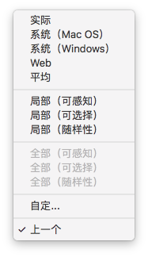
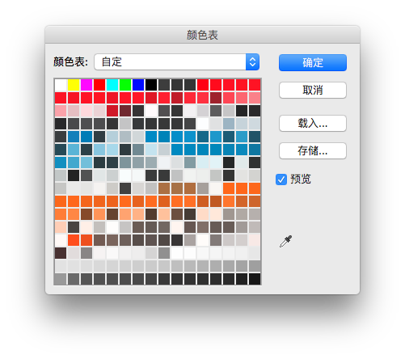
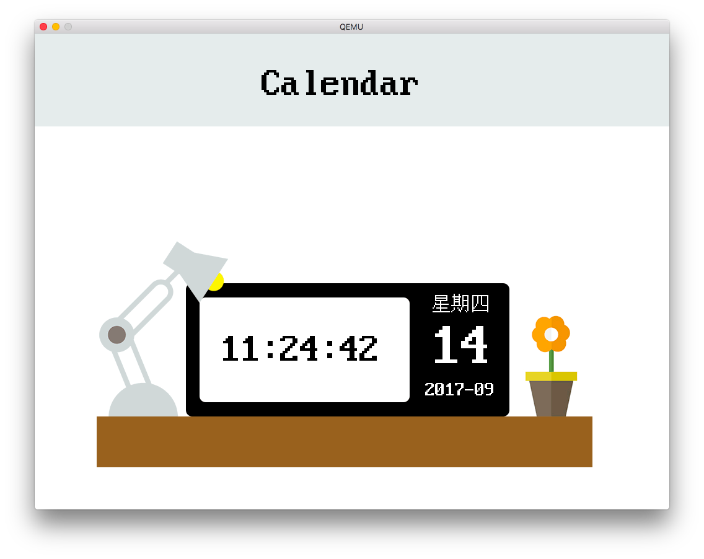
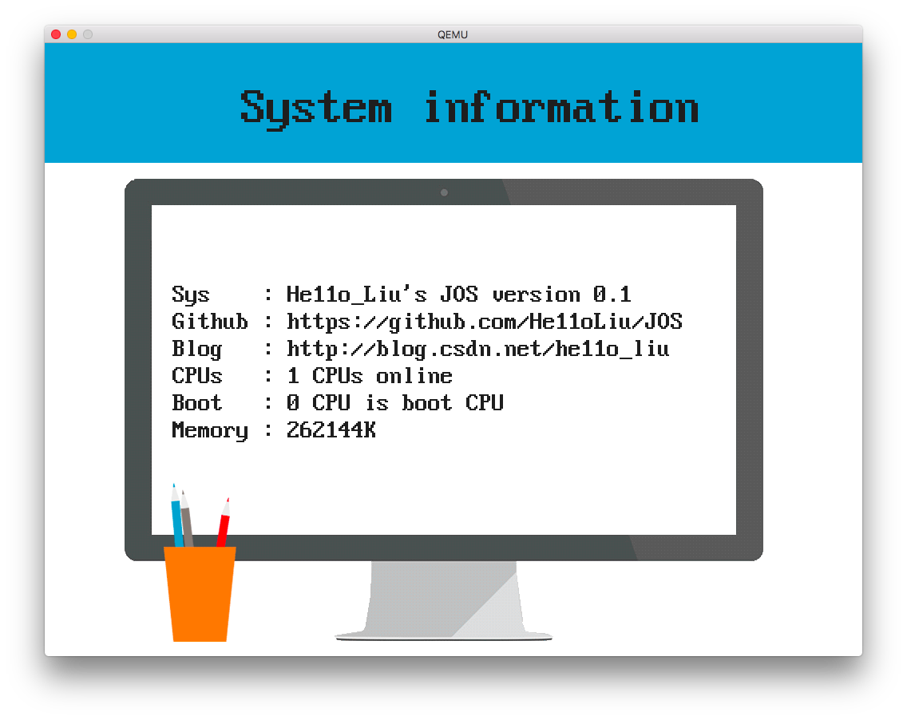
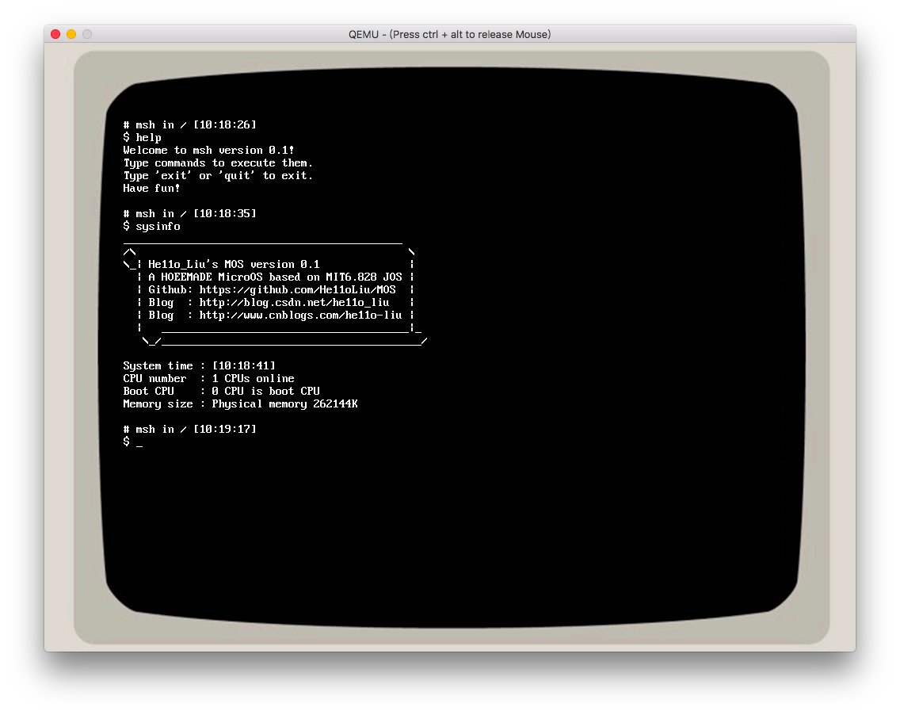

# JOS图形化界面GUI用户程序接口


本文将介绍在本人`JOS`中实现的简单图形界面应用程序接口，应用程序启动器，以及一些利用了图形界面的示例应用程序。

本文主要涉及以下部分：

- 内核/用户`RW/RW`调色板`framebuffer`共享区域
- `8bit`颜色深度`BMP`格式图片读取与绘制
  - 读`BMP`头总是出现问题？不合理的数据?
  - 为啥读出来的图片颜色怪怪的！！
  - 为啥是倒的，还有的运气不好出错了
  - 如果是想绘制多个图片在一页上，调色板问题？？
  - 如果读到一个32位色的图片咋办？
- 图形化界面数据结构，框架以及接口设计
- 利用图形化接口实现应用程序：
  - 日历程序（实时时钟刷新）
  - 系统信息获取
  - 终端`CGA`模拟器

## PART1

### framebuffer

在`图形库`中，已经将图形模式打开，将显存映射到内存中的一段空间。并进行了简单的测试。

实际上，直接对显存写是很不负责任的行为。很早之前在写`java`的界面的时候，就接触了双缓冲技术，其实与显示有关的思想都是差不多的，我们应该提供一个`framebuffer`。当完成一个`frame`后，再将这个`frame` update到显存中。

```c
uint8_t *framebuffer;
void init_framebuffer(){
  	if((framebuffer = (uint8_t *) kmalloc((size_t)(graph.scrnx*graph.scrny)))== NULL)
        panic("Not enough memory for framebuffer!");
}

void update_screen(){
    memcpy(graph.vram,framebuffer,graph.scrnx*graph.scrny);
}
```

经过实现`kmalloc`与`kfree`，已经可以分配这个缓冲区，并直接向缓冲区写入，最后再进行`update`

```c
#define PIXEL(x, y) *(framebuffer + x + (y * graph.scrnx))
int draw_xx()
{
	xxx;
	update_screen();
}
```

### canvas (这种思路已经废弃)

从一个单一的应用程序角度来看，应分配一个单独的画布，然后选择在一个位置显示。

```c
typedef struct canvas
{
    uint16_t width;
    uint16_t height;
    uint8_t *data;
} canvas_t;
```

设计的模式是，与文件系统服务器类似，提供一个图形系统服务器，用于接收从其他的程序发来的请求。请求包括显示的位置，以及`canvas`。该服务器将`canvas`写入frambuffer并update。其他程序与图形服务器通过`IPC`进行通讯。

剩余的事情就可以交给用户空间了。包括对`canvas`的处理，更新显示，添加各种元件。之前写的字库也可以不用写在内核了...

首先实现绘制`canvas`。

```c
int draw_canvas(uint16_t x, uint16_t y, canvas_t *canvas)
{
    int i, j;
    int width = (x + canvas->width) > graph.scrnx ? graph.scrnx : (x + canvas->width);
    int height = (y + canvas->height) > graph.scrny ? graph.scrny : (y + canvas->height);
    cprintf("width %d height %d\n",width,height);
    for (j = y; j < height; j++)
        for (i = x; i < width; i++)
            PIXEL(i, j) = *(canvas->data + (i - x) + (j - y) * canvas->width);
    update_screen();
    return 0;
}
```

然后在`lib`中新建`canvas`的相关方法：

```c
int canvas_init(uint16_t width, uint16_t height, canvas_t *canvas);
int canvas_draw_bg(uint8_t color, canvas_t *canvas);
int canvas_draw_ascii(uint16_t x, uint16_t y, char *str, uint8_t color, canvas_t *canvas);
int canvas_draw_cn(uint16_t x, uint16_t y, char *str, uint8_t color, canvas_t *canvas);
int canvas_draw_rect(uint16_t x, uint16_t y, uint16_t l, uint16_t w, uint8_t color, canvas_t *canvas);
```

其中只需要将原来的`PIXAL`宏换为

```c
#define CANVAS_PIXEL(canvas, x, y) *(canvas->data + x + (y * canvas->width))
```

测试`canvas`

```c
    canvas_t canvas_test;
    canvas_init(300, 200, &canvas_test);
    uint8_t testcanvas[60000];
    canvas_test.data = (uint8_t *)testcanvas;
    canvas_draw_bg(0x22,&canvas_test);
    canvas_draw_ascii((uint16_t)2, (uint16_t)2, test_ascii, (uint8_t)0xff, &canvas_test);
    canvas_draw_cn((uint16_t)2, (uint16_t)50, test_cn, (uint8_t)0xff, &canvas_test);
    draw_canvas(500, 500, &canvas_test);
```

### 图像处理的两种设计与遇到的问题

- 第一种设计与之前描述的一致：

  提供一个图像服务器，接收请求，从用户进程传来需要画的画布和显示位置，并在位置上进行绘画。这种方式遇到的问题是画布过大，一页可能装不下。需要`mmap`（还没写）

- 第二种设计是一个`launcher`和`application`两个单独的单页面切换制度。

  这样就是`launcher`提供应用启动界面，`application`提供应用界面。


重新回顾了一下内存分配，内核与用户态数据共享的方法后，决定先就第二个思路实现一个简单的用户内核均可见可读写的`Framebuffer`。

### 实现`RW/RW`的`Framebuffer`

#### 分析如何做才能内核用户均可读写

**首先分析一个之前做过的`pages`，是如何做到用户态可以读，内核态可以写的。**

- 在`mem_init`的时候在在内核空间中分配指定的空间给`pages`

  ```c
  pages = boot_alloc(sizeof(struct PageInfo) * npages);
  memset(pages, 0, sizeof(struct PageInfo) * npages);
  ```

- 利用`boot_map_region`将其映射到内核页表中的`UPAGES`的位置。

  ```c
  boot_map_region(kern_pgdir, UPAGES, PTSIZE, PADDR(pages), PTE_U | PTE_P);
  ```

- 这样内核中依然可以通过`pages`访问页表，而用户程序在`entry`的时候通过给`pages`变量赋予存储位置

  ```
  	.globl pages
  	.set pages, UPAGES
  ```

  也可以通过`pages`变量进行访问。

#### 预留内存用于`framebuffer`

再思考如果需要这么一个`framebuffer`，我们需要放到哪里。仿造上面的`UVPD`，`UPAGES`，等，决定就放在接近`ULIM`的位置。一个`PTSIZE`也远超我们需要的空间，为以后扩展也留下了余量。

```c
/*
 * ULIM, MMIOBASE -->  +------------------------------+ 0xef800000
 *                     |  Cur. Page Table (User R-)   | R-/R-  PTSIZE
 *    UVPT      ---->  +------------------------------+ 0xef400000
 *                     |          RO PAGES            | R-/R-  PTSIZE
 *  FRAMEBUF    ---->  +------------------------------+ 0xef000000
 *                     |        FRAME BUFFER          | RW/RW  PTSIZE
 *    UPAGES    ---->  +------------------------------+ 0xeec00000
 *                     |           RO ENVS            | R-/R-  PTSIZE
 * UTOP,UENVS ------>  +------------------------------+ 0xee800000
 */

// User read-only virtual page table (see 'uvpt' below)
#define UVPT (ULIM - PTSIZE)
// Read-only copies of the Page structures
#define UPAGES (UVPT - PTSIZE)
// Read-write framebuffer
#define FRAMEBUF (UPAGES - PTSIZE)
// Read-only copies of the global env structures
#define UENVS (FRAMEBUF - PTSIZE)
// #define UENVS (UPAGES - PTSIZE)
```

#### 什么时候映射到内核的页表？

由于图像初始化在内存初始化之后，需要留一个接口来进行映射。（`boot_map`是隐式函数）

```c
void map_framebuffer(void *kva)
{
	boot_map_region(kern_pgdir, FRAMEBUF, PTSIZE, PADDR(kva), PTE_W | PTE_U | PTE_P);
}
```

在分配好内核中的`Framebuffer`就可以开始映射了

```c
void init_framebuffer()
{
    if ((framebuffer = (uint8_t *)kmalloc((size_t)(graph.scrnx * graph.scrny))) == NULL)
        panic("Not enough memory for framebuffer!");
    map_framebuffer(framebuffer);
}
```

#### 用户程序如何访问？

在`libmain`的时候初始化即可

```c
	framebuffer = (uint8_t *)FRAMEBUF;
```

#### 用户态刷新屏幕？

用户程序在写完`frambuffer`后，如何才能刷新屏幕？这又需要一个新的内核调用

```c
static int sys_updatescreen()
{
	update_screen();
	return 0;
}
```

配套的一些代码就不解释了。


## PART2

上一个部分已经将一个用户与内核均可读写的缓冲区域，并提供了一个系统调用，用于将显示缓存内容拷贝至`MMIO`显存。从理论上来说，用户空间的程序现在已经可以直接在这块`Framebuffer`上绘制任何图形。

但是对于一个友好的用户界面，至少要支持一种格式的图片显示。这里选择一种最简单的，没有压缩过的位图显示实现。推荐各位想自己写图形界面的小伙伴也从这里入手。

关于`BMP`的读取可以参考这篇文章[*256-Color VGA Programming in C Bitmaps & Palette Manipulation*](http://www.brackeen.com/vga/bitmaps.html)。要注意详细读其中的每一个细节，直接扫一眼看代码写的话会遇到很多问题，下面会提到我遇到的问题与解决方案。

### Bitmap图片显示

> There are many file formats for storing bitmaps, such as RLE, JPEG, TIFF, TGA, PCX, BMP, PNG, PCD and GIF. The bitmaps studied in this section will be 256-color bitmaps, where eight bits represents one pixel.
>
> One of the easiest 256-color bitmap file format is Windows' BMP. This file format can be stored uncompressed, so reading BMP files is fairly simple.

`Windows' BMP`是没有压缩过的，所以读这种`BMP`会非常方便。这里也准备就支持这种格式的图片。

> There are a few different sub-types of the BMP file format. The one studied here is Windows' RGB-encoded BMP format. For 256-color bitmaps, it has a 54-byte header (Table III) followed by a 1024-byte palette table. After that is the actual bitmap, which starts at the lower-left hand corner.

BMP的文件格式如下：

| Data                     | Description                        |
| ------------------------ | ---------------------------------- |
| `WORD Type;`             | File type. Set to "BM".            |
| `DWORD Size;`            | Size in BYTES of the file.         |
| `DWORD Reserved;`        | Reserved. Set to zero.             |
| `DWORD Offset;`          | Offset to the data.                |
| `DWORD headerSize;`      | Size of rest of header. Set to 40. |
| `DWORD Width;`           | Width of bitmap in pixels.         |
| `DWORD Height;`          | Height of bitmap in pixels.        |
| `WORD Planes;`           | Number of Planes. Set to 1.        |
| `WORD BitsPerPixel;`     | Number of bits per pixel.          |
| `DWORD Compression;`     | Compression. Usually set to 0.     |
| `DWORD SizeImage;`       | Size in bytes of the bitmap.       |
| `DWORD XPixelsPerMeter;` | Horizontal pixels per meter.       |
| `DWORD YPixelsPerMeter;` | Vertical pixels per meter.         |
| `DWORD ColorsUsed;`      | Number of colors used.             |
| `DWORD ColorsImportant;` | Number of "important" colors.      |

下面就我遇到的四个严重的问题，来实现`BMP`格式的图片读取。

### Q1：读头总是出现问题？不合理的数据？

这里要注意`GCC`默认4字节对齐！！！！！！

**但是`Bitmap`的文件头是`14Bytes`，如果不加特殊标记，其会变成`16Bytes`，导致文件偏移错误**

```c
typedef struct bitmap_fileheader
{
    uint16_t bfType;
    uint32_t bfSize;
    uint16_t bfReserved1;
    uint16_t bfReserved2;
    uint32_t bfOffBits;
}__attribute__((packed)) bitmap_fileheader;

typedef struct bitmap_infoheader
{
    uint32_t biSize;
    uint32_t biWidth;
    uint32_t biHeight;
    uint16_t biPlanes;
    uint16_t biBitCount;
    uint32_t biCompression;
    uint32_t biSizeImage;
    uint32_t biXPelsPerMeter;
    uint32_t biYPelsPerMeter;
    uint32_t biClrUsed;
    uint32_t biClrImportant;
} bitmap_infoheader;
```

这里添加的`__attribute__((packed))`关键字用于告诉编译器，最小单位进行对齐，而不使用默认的四单位进行对齐。

### Q2：为啥读出来的图片颜色怪怪的！！

最开始设置`VBE`的时候，我以为所谓`8位色`就是真`8位色`，之前徒手撸`FPGA`的显卡的时候也是这么设计的，直接读取后分位后丢给一个`D/A`输出给`VGA`变成各自的颜色信号。但是实际系统没有这么简单，其实现了一个`8位`到`32位`的对应关系，提供了`256 `位色的调色板。这样能支持更自由的调色方案，显示更加定制化的颜色。所以之前我没有初始化调色板，利用了系统默认的调色板，所以显示才出现问题。

但是理解`BMP`又出现了偏差，以为大体上是遵循`RGB3bit3bit2bit`的配色方案，先写了一个初始化调色板的函数：

```c
void init_palette()
{
    int i;
    outb(0x03c8, 0);
    for (i = 0; i < 256; i++)
    {
        outb(0x03c9, (i & 0xe0) >> 2); //| 0xA);
        outb(0x03c9, (i & 0x1c) << 1); //| 0xA);
        outb(0x03c9, (i & 0x03) << 3); //| 0xA);
    }
}
```

其选择了最接近想表达的颜色的32位颜色并给端口输出。但是颜色还是不大对劲，调色板应该不是这么简单的对应关系。

重新读之前文章的介绍，发现每一个图片文件都有自己的调色板，这种调色板还不太一样，之后使用`PS`绘制系统图标的时候深有感触，后面再说。

现在面临的主要问题是，我们需要从用户空间读取文件后，才能取出调色板的具体内容，但是通过端口与`VGA`调色板的通讯在我的设计里面是不能够通过用户空间实现的。那么又要进入内核。那么这个调色板的信息如何传给内核？动态分配的话不能通过栈来传，内核没有用户的页表，也就无法通过地址进行访问。

为了能够从用户空间读取调色板配置文件，并在内核中修改调色板，在原来设计`framebuffer`的地址上又重新设计了一块专门用于保存调色板的区域，与之前的`framebuffer`一样，都是`RW/RW`的。

计算一下占用的空间：`256 * sizeof(uint8_t) + sizeof(uint8_t)*SCRNSIZE`还是比`PTSIZE`小，没关系，继续用之前分配的`memorylayout`，只需要定义一个结构体方便我们来算偏移即可。

所以对于一个`BMP`图片浏览器，显示图片的整个流程是这样的：

- 用户读BMP文件头
- 用户读BMP调色板
- 放入与内核共享的调色板空间
- 系统调用内核修改调色板
- 用户读文件内容
- 用户写入与内核共享的显示缓存空间
- 系统调用更新屏幕

到这里还有误解，认为`BMP`的调色板可能大致一致 "然后发现几个文件的调色基本一致，于是单独设计了一个用于保存调色板信息的文件，用以下工具导出"。当时的记录是这样，naive！但是这个程序对于其后导出`PS`调色板有帮助，所以也放在这里。

```c
void read_bmp_palette(char *file)
{
    FILE *fp;
    long index;
    int x;
    /* open the file */
    if ((fp = fopen(file, "rb")) == NULL)
    {
        printf("Error opening file %s.\n", file);
        exit(1);
    }
    uint8_t buf[1000];
    bitmap_fileheader head;
    bitmap_infoheader info;
    uint16_t width, height;
    bitmap_image image;
    bitmap_infoheader *infoheader = &info;
    fread(&head, sizeof(bitmap_fileheader),1,fp);
    fread( &info, sizeof(bitmap_infoheader),1,fp);
    struct palette palette[256];
    FILE *fout = fopen("palette.plt", "wb");
    
    for (int i = 0; i < 256; i++)
    {
        fread(&palette[i], sizeof(struct palette), 1, fp);
        palette[i].rgb_red >>= 2;
        palette[i].rgb_green >>= 2;
        palette[i].rgb_blue >>= 2;
        fwrite(&palette[i], sizeof(struct palette), 1, fout);
    }
    fclose(fout);
    fclose(fp);
}
```

好了，到这里运气好的话，应该可以正常颜色绘制出来一个位图了。（那啥读取位图内容显示在屏幕上的代码实在太简单了，就不单独说了）

### Q3：为啥是倒的，还有的运气不好出错了

之前之所以说运气好，是因为刚好这个图片信息中的高为正的，那么按照基本逻辑，可以画出来一个倒的图片。还是太naive，不好好看文档中的头文件具体参数描述，想当然的给了图片高为一个无符号数。

在`BMP`的文件头中，高为一个有符号数。正表示下面的位图像素信息是倒着来的，负表示下面的位图像素信息是正着的……这个设计，好吧...

### Q4：如果是想绘制多个图片在一页上，调色板问题？？

在`Q2`中提到，想用一个调色板文件预配置后就不管其他图片的调色板的思路太单纯了...当使用一些比较`fancy`的素材进来的时候，发现其颜色根本完全不一样，失真的可怕。

为了更加理解调色板这个设定，我们需要一个`photoshop`。设置图片为`图像->模式->索引模式`后，就可以生成我们需要的位图了。注意这里的设置页面：



可以发现系统有自己的调色板，可能用于绘制所有的图标使用的。（当然可能也已经是历史的产物了）后面我将用相同的思路实现图标的绘制。还有一些局部的选项，这样就会利用一个颜色更加单一，但是转化出来的图片更接近32位色的图片的调色板来生产了。

打开`图像->模式->颜色表`可以看到当前图片使用的调色板：



可以看到它完全不按照套路出牌，并没有之前说的`R3G3B2`的影子。

所以对于一个页面，如何选择调色板？我的方案是把这个页面所有的素材丢到一个`ps`文件中，并生成针对这个页面还原度最高的调色板方案。在绘制这个页面的时候先载入这个页面的调色板，再进行绘制。

`PS`可以导出调色板，按照官方的文档，也是一个简单的二进制的堆叠，与上面的思路类似写一个调色板转系统`plt`文件的导出即可。

### Q5：如果读到一个32位色的图片咋办？

好吧，我的选择是不读，可以在网上找找`32位`色妥协到`8位`色的算法，然而实在效果非常糟糕，单独生成调色板算法就复杂了，不如交给`PS`。毕竟这不是操作系统的重点。


## Part3

本部分将解释我设计的图形化界面数据结构，框架以及接口。

其实这部分设计的比较乱，也就只能支持单页面切换的需求了。作为一个技术试探是足够了，但是扩展性很差，想继续在这上面做文章可能需要推倒重来。

先看效果图：



界面由标题和内容组成，界面是应用程序请求屏幕资源的基本单位。界面的数据结构如下：

```c
struct interface
{
    uint8_t titletype;
    char title[MAX_TITLE];
    uint8_t title_textcolor;
    uint8_t title_color;
    uint8_t content_type;
    uint8_t content_color;

    // about the size and buff of interface
    uint16_t scrnx;
    uint16_t scrny;
    uint8_t *framebuffer;
};
```

其包含了这个界面的基本信息，以及当前屏幕的各项参数，各种函数将直接向`framebuffer`上操作。

```c
void draw_interface(struct interface *interface);
void draw_title(struct interface *interface);
// if color == back means transparent
int draw_cn(uint16_t x, uint16_t y, char *str, uint8_t color, uint8_t back, uint8_t fontmag, struct interface *interface);
int draw_ascii(uint16_t x, uint16_t y, char *str, uint8_t color, uint8_t back, uint8_t fontmag, struct interface *interface);
void draw_fontpixel(uint16_t x, uint16_t y, uint8_t color, uint8_t fontmag, struct interface *interface);
void interface_init(uint16_t scrnx, uint16_t scrny, uint8_t *framebuffer, struct interface *interface);
void add_title(char *title, uint8_t title_textcolor, uint8_t title_color, struct interface *interface);
int init_palette(char *plt_filename, struct frame_info *frame);
void draw_content(struct interface *interface);
int draw_screen(uint16_t x, uint16_t y, struct screen *screen, uint8_t color, uint8_t back, uint8_t fontmag);
```

提供了以上基本操作，实现都很简单，没有做错误处理。

值得一提的是字体的设置。由于用的点阵字库，放大后会马赛克。这里使用的方法为打包具体绘制像素方法至`draw_fontpixel`，其提供了多个像素抽象为一个字体像素进行统一绘制的方法。


## Part 4

本部分终于到了图形界面的程序应用了。具体应用如何使用上面设计的接口呢？

首先看一个最简单的例子：

```c
#include <inc/lib.h>
#define BACKGROUND 0x00
struct interface interface;

void input_handler();
void display_info();

void umain(int argc, char **argv)
{
    int r;
    // 初始化本界面使用的调色板
    if ((r = init_palette("/bin/sysinfo.plt", frame)) < 0)
        printf("Open palette fail %e\n", r);
    // 初始化界面信息
    interface_init(graph.scrnx, graph.scrny, graph.framebuffer, &interface);
    interface.titletype = TITLE_TYPE_TXT;
    strcpy(interface.title, "System information");
    interface.title_color = 0x5a;
    interface.title_textcolor = 0xff;
    interface.content_type = APP_NEEDBG;
    interface.content_color = BACKGROUND;
    // 绘制界面
    draw_interface(&interface);
    // 绘制Bitmap
    if ((r = draw_bitmap("/bin/sysinfo.bmp", 100, 160, &interface)) < 0)
        printf("Open clock back fail %e\n", r);
    // 显示信息
    display_info();
    // 绘制结束，刷新屏幕
    sys_updatescreen();
    // 处理按键中断
    input_handler();
}

void input_handler()
{
    unsigned char ch;
    ch = getchar();
    while (1)
    {
        switch (ch)
        {
        case KEY_ESC:
            exit();
        }
        ch = getchar();
    }
}

void display_info()
{
    ...
    struct sysinfo info;
  	// 通过系统调用获取一些系统信息
    sys_getinfo(&info);
    draw_ascii(display_x, display_y, "Sys    : He11o_Liu's JOS version 0.1", 0xff, 0x00, fontmeg, &interface);

    display_y += font_height;
    draw_ascii(display_x, display_y, "Github : https://github.com/He11oLiu/JOS", 0xff, 0x00, fontmeg, &interface);
    display_y += font_height;
    draw_ascii(display_x, display_y, "Blog   : http://blog.csdn.net/he11o_liu", 0xff, 0x00, fontmeg, &interface);
    ...
}
```

一个简单的具有图像界面的程序由以下步骤：

- 初始化本界面使用的调色板
- 初始化界面信息
- 绘制界面，绘制内容
- 更新屏幕
- 开启按键处理，具体事件具体处理

### 关于具体应用程序的一些要点

#### 应用启动器


启动器算比较复杂的一个部分，专门设计了一个单独的数据结构和绘制方法：

```c
struct launcher_content
{
    int app_num;
    int app_sel;
    uint8_t background;
    char icon[MAX_APP][MAX_PATH];
    char app_bin[MAX_APP][MAX_PATH];
};

void draw_launcher(struct interface *interface, struct launcher_content *launcher);
```

用`icon`来保存对应的`app`的图标文件路径，用`app_bin`来保存对应的程序的路径。当选择了对应的程序的时候`spawn`这个程序，并等待其运行结束后回收进程并重绘启动器：

```c
void launch_app()
{
    char *app_bin = launcher.app_bin[launcher.app_sel];
    int r;
    char *argv[2];
    argv[0] = app_bin;
    argv[1] = 0;
    printf("[launcher] Launching %s\n",app_bin);
    if ((r = spawn(app_bin, (const char **)argv)) < 0)
    {
        printf("App %s not found!\n",app_bin);
        return;
    }
    wait(r);
    printf("[launcher] %s normally exit\n",app_bin);
    init_palette("/bin/palette.plt", frame);
    refresh_interface();
}
```

#### 日历


由于没有写系统时钟，只提供了对于RTC的系统调用。这里实现Fork了一个进程用于监控RTC的更新，并在适当时候更新屏幕，主进程用于监听键盘，并在退出的时候摧毁子进程。

### 系统信息



这个程序的代码已经放在上面了，主要是设计了一个新的`syscall`，用于从内核中返回一些基本系统信息。


## Part4 模拟CGA显示模式终端应用



终端程序与普通程序的设计思路完全不同，本部分将根据我的思考来一步步阐述如何实现终端`APP`。

### 思路

作为一个终端程序，

- 终端模拟器应该支持一种`printf`能显示到屏幕的功能。

  - `printf`是向文件描述符`1`进行输出。

  - 查看之前写的`console`代码，`openconsole`的操作就是分配一个文件描述符，设置文件操作为(键盘输入，串口输出)的策略。

  - 所以我们这个终端模拟器应该提供一种新的`device`，这种`device`提供了(键盘输入，屏幕输出)的功能。

    ```c
    struct Dev devscreen =
        {
            .dev_id = 's',
            .dev_name = "screen",
            .dev_read = devscreen_read,
            .dev_write = devscreen_write,
            .dev_close = devscreen_close,
            .dev_stat = devscreen_stat};
    ```

  - 直接在屏幕上显示出来并不是一个很好的选择，参考`CGA`的显示，设计了一个屏幕字符缓冲区。

    ```c
    struct screen
    {
        uint8_t screen_col;
        uint8_t screen_row;
        uint16_t screen_pos;
        char screen_buf[SCREEN_SIZE];
    };
    ```

  - 提供新的`bprintf`方法，方便`screen device`调用。

- 作为终端模拟器，其需要集成`fork`出来的各种进程的输出。

  - 首先对于其他的程序，其输出也是`printf`
  - 其他的程序会继承其父进程的文件描述符表。
  - 父进程中的文件描述符`1`号，则应该指向上面定义的`screen` （这条思路最后没走通）

### 思路中的`part1`

这个部分的实现还是比较顺利的。上面已经定义了新的`device`。

- 这个新的`device`的`read`策略，还是从键盘读，无须进行修改。
- 而这个`device`的写策略，则需要写入到屏幕了。这里新写了一个`bprintf`的函数与其配套方法。(`bprintf` a.k.a `printf to buf`）

`bprintf`的基本实现与之前在`CGA`模式的输出类似，所以才叫仿`CGA`模式。主要是`bputchar`的实现：

```c

void bputchar(char c)
{
    switch (c)
    {
    case '\b': /* backspace */
        if (screen.screen_pos > 0)
        {
            screen.screen_pos--;
            // delete the character
            screen.screen_buf[screen.screen_pos] = ' ';
        }
        break;
    case '\n': /* new line */
        screen.screen_pos += SCREEN_COL;
    /* fallthru */
    case '\r': /* return to the first character of cur line */
        screen.screen_pos -= (screen.screen_pos % SCREEN_COL);
        break;
    case '\t':
        bputchar(' ');
        bputchar(' ');
        bputchar(' ');
        bputchar(' ');
        break;
    default:
        screen.screen_buf[screen.screen_pos++] = c; /* write the character */
        break;
    }
    // When current pos reach the bottom of the creen
    // case '\n' : screen.screen_pos -= SCREEN_COL will work
    // case other: screen.screen_pos must equal to SCREEN_SIZE
    if (screen.screen_pos >= SCREEN_SIZE)
    {
        int i;
        // Move all the screen upward (a line)
        memmove(screen.screen_buf, screen.screen_buf + SCREEN_COL, (SCREEN_SIZE - SCREEN_COL) * sizeof(uint8_t));
        // Clear the bottom line
        for (i = SCREEN_SIZE - SCREEN_COL; i < SCREEN_SIZE; i++)
            screen.screen_buf[i] = ' ';
        screen.screen_pos -= SCREEN_COL;
    }
    screen.screen_col = SCREEN_COL;
    screen.screen_row = SCREEN_ROW;
    draw_screen(100, 80, &screen, 0x00, 0xff, 1);
}
```

`bputchar`实现了对特殊描述符，换行，翻页的情况的处理，并将打印的内容放入屏幕字符缓冲区。

最后要实现的就是把屏幕缓冲区的内容放倒屏幕上。这个实现起来就比较简单了，遍历字符串，然后一个个字从字库中获取显示信息显示出来即可。


### 思路中的`part2`

`part2`才是设计终端中需要动脑子的地方。正如思路中所说，我一开始的想法是：

### 老思路

*父进程中的文件描述符`1`号，则应该指向上面定义的`screen`*

然而没有考虑这个问题：

**`interface`与`screen`参数均属于与之平等的另一个用户程序！**在调用`bprintf`的时候，没有初始化`screen`，也不知道`interface`在哪里。

**之所以`CGA`模式可以使用这个思路是因为`CGA`的文字缓冲区是在内核中，可以看为这项服务是内核提供的，是一个上下级的关系，而不是平行的**

如果必须要走这条路，有以下解决方法：

- 在库中判断没有参数时，直接初始化`screen`与`interface`，可以做到直接新建一个输出页的效果。
- 提升终端到内核中运行（无法忍受）
- 使终端成为如同文件系统的非普通程序，接收输出请求。这个也很复杂，不够优雅！！！


### 新思路 ： 利用 `Pipe`!!!!!!!!

老思路中的第一条解决方法走通了后又思考了一会儿，实在不想走第二第三条路。

换个思路一想，原来这个事可以这么简单。申请一个`pipe`，读取端给 （输出到屏幕的 ）服务进程作为输入来源，输出端给用户程序作为输出。程序输出的内容会通过`pipe`发送给服务进程，最终服务进程显示到屏幕上即可。

整个程序的流程如下：

- 终端程序打开屏幕输出设备，给文件描述符`1`（默认输出）
- 终端程序申请`pipe`
- 终端程序`fork`子进程
  - 子进程关闭读的`pipe`，保留写的`pipe`，并将写的`pipe`给默认输出`1`，后面的程序输出都会写进`pipe`中。子进程开始运行`shell`。
  - 父进程关闭写的`pipe`，保留读的`pipe`，并将读的`pipe`给默认输入`0`，后面程序的输入都会读`pipe`中的内容。父进程进入循环，服务所有的输入输出到屏幕的功能。

来看核心代码：

```c

void umain(int argc, char **argv)
{
	...
    close(1);
    // 打开屏幕CGA输出到文件描述符1
    if ((r = openscreen(&interface)) < 0)
        panic("fd = %e\n", r);
    cprintf("fd = %d\n", r);
    // 申请一个pipe
    if ((r = pipe(p)) < 0)
    {
        cprintf("pipe: %e", r);
        exit();
    }
    readfd = p[0];
    writefd = p[1];
    r = fork();
    if (r == 0)
    {
        close(readfd);
        close(1);
      	// 写入端给子进程作为其输出默认文件描述符1
        dup(writefd, 1);
      	// 运行shell (修改过，没有文件描述符操作版本)
        msh(argc, argv);
        printf("msh exit\n");
        exit();
    }
    else
    {
        close(writefd);
        close(0);
      	// 读入端作为其默认读取文件描述符0
        if (readfd != 0)
            dup(readfd, 0);
        close(readfd);
    }

    e = &envs[ENVX(r)];
    while(1)
    {
      	// 获取所有的pipe中的数据并显示在模拟CGA屏幕上
        r = getchar();
        printf("%c", r);
        // 当shell退出的时候退出
        if(e->env_status == ENV_FREE)
            break;
    }
}
```


## Part 收获

这个部分将记录这几天写图形界面的收获。

之前看知乎上的大佬们的论调：*图形界面和操作系统有啥关系？没啥好写的，简单！*其实写写简单的图形界面一个是转换一下思路，有简单可见的产出激励，另一个是进一步理解体会操作系统的设计，并实际修改一些`JOS`中的设计，并实现一些类似之前照着任务指南写出来的功能。In another words, get your hands dirty.

### 用户与内核的关系

按照JOS的思路，还是希望保持一个相对小的内核，提供最基本的服务，剩下的交给用户空间玩耍。但是到实际的问题上，包括了

- 功能的划分，用户需要的服务能否在用户态实现大部分，内核实现小部分（如上次的用户空间的页错误处理与这次的`Framebuffer`与屏幕更新）。这样的设计更加`flexable`，并且保证了呆在内核中的时间非常短暂（毕竟还用着`big kernel lock`…)

- 内核与用户空间的信息交换。栈或者固定地址的交互。

  栈比较灵活，可以在每次的系统调用的时候直接压进去，交换完了后再取回来。但是只能传值，传的内容比较少。

  固定地址则使得系统变得不那么灵活，不利于扩展与移植。但是可以高效的大量数据交换。在写这块的时候实现了`kmalloc`，并理解了之前`mem_init`时做的各种映射的意义。

### 用户与用户的关系（用户空间程序）

理想的用户与用户的关系是平齐的（不提供服务的用户），在写用户程序的时候不知道其父进程是谁，也不会要求子进程知道自己的存在。但是跨进程之间的服务需求仍然存在，如对于一个进程输出的获取，或图形界面中的界面重叠。这就需要一个服务提供者的存在，来抽象用户之间的需求。比如之前设计的文件系统服务器，比如这回本来准备实现的图形界面服务器。


### 文件描述符 | 句柄 | FD

这部分感触最深的是`unix`中的文件描述符的设计，简直太妙。将所有的内容全部抽象成文件，就可以灵活的在不同的需求之前切换。最简单的读写文件，读写串口，读写屏幕，pipe均使用的这种抽象。

 

这种抽象将抽象层和具体实现层分开，降低耦合度的同时提供了非常高的灵活性。