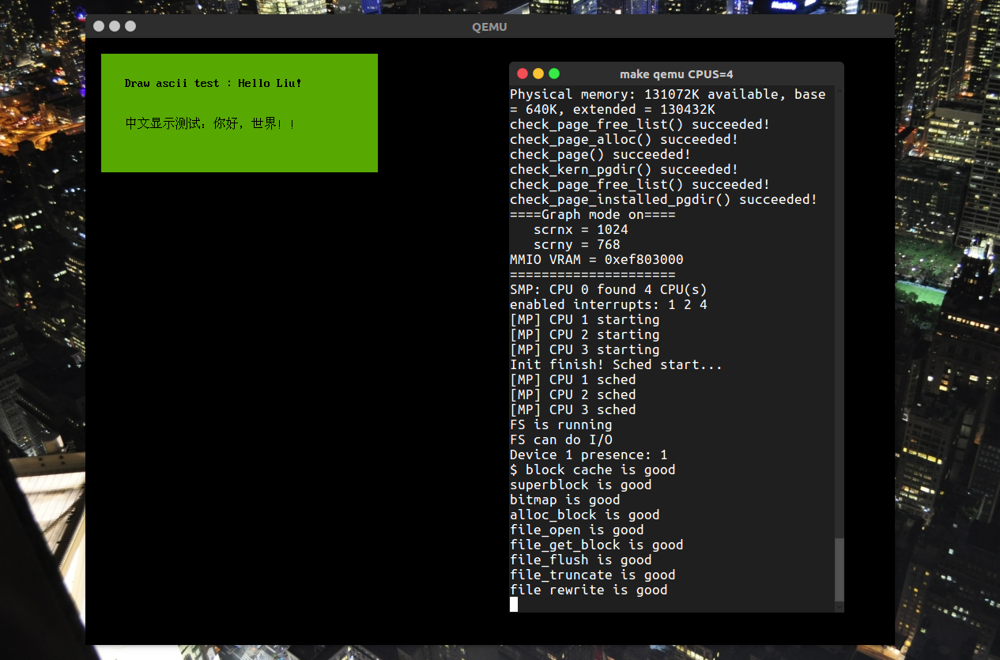

# JOS Graph




## About VESA

`Video Electronics Standards Association`（视频电子标准协会，简称“VESA”）是制定计算机和小型工作站视频设备标准的国际组织，1989年由NEC及其他8家显卡制造商赞助成立。创立VESA的原始目的是要制定分辨率为`800x600`的SVGA视频显示标准。其后，VESA公告一系列的个人电脑视频周边功能的相关标准。


## VBE 功能调用

参考博客[CSDN博客](http://blog.csdn.net/guzhou_diaoke/article/details/8450689)

`VBE`功能调用

- AH必须等于4FH，表明是VBE标准
- AL等于VBE功能号，0<= AL <= 0BH
- BL等于子功能号，也可以没有子功能
- 调用`INT 10H`
- 返回值在AX中
  - `AL=4FH`：支持该功能
  - `AL!=4FH`：不支持该功能
  - `AH=00H`：调用成功
  - `AH=01H`：调用失败
  - `AH=02H`：当前硬件配置不支持该功能
  - `AH=03H`：当前的显示模式不支持该功能

### 具体功能

此部分参考*VESA编程——GUI离我们并不遥远*，原作者博客已关闭。

#### 功能0x00：返回控制器信息

```
输入：
	AX      = 4F00h     返回VBE控制器信息
	ES:DI   =           指向存放VbeInfoBlock结构体的缓冲区指针	 
输出：
	AX      =           VBE返回状态
```

这个函数返回一个VbeInfoBlock结构体，该结构体定义如下：

```c
// Vbe Info Block
typedef struct {
    unsigned char       vbe_signature;
    unsigned short      vbe_version;
    unsigned long       oem_string_ptr;
    unsigned char       capabilities;
    unsigned long       video_mode_ptr;
    unsigned short      total_memory;
    unsigned short      oem_software_rev;
    unsigned long       oem_vendor_name_ptr;
    unsigned long       oem_product_name_ptr;
    unsigned long       oem_product_rev_ptr;
    unsigned char       reserved[222];
    unsigned char       oem_data[256];	
} VbeInfoBlock;
```

- `vbe_signature`是VBE标识，应该填充的是”VESA”
- `vbe_version`是VBE版本，如果是0300h则表示3.0版本
- `oem_string_ptr`是指向oem字符串的指针，该指针是一个16位的`selector:offset`形式的指针，在实模式下可以直接使用。
- `video_mode_ptr`是指向视频模式列表的指针，与`oem_string_ptr`类型一样
- `total_memory`是64kb内存块的个数
- `oem_vendor_name_ptr`是指向厂商名字符串的指针
- `oem_product_name_ptr`是指向产品名字符串的指针

#### 功能01 返回VBE模式信息

```
输入：
    AX        = 0x4F01  	返回VBE模式信息
    CX        = 			模式号  
    ES:DI     =   			指向VBE特定模式信息块的指针  
输出：  
    AX        =				VBE返回值  
```

这个函数返回一个ModeInfoBlock结构体，其中重要的部分如下：

- `mode_attributes`字段，这个字段描述了图形模式的一些重要属性。其中最重要的是第4位和第7位。第4位为1表示图形模式(Graphics mode)，为0表示文本模式(Text mode)。第7位为1表示线性帧缓冲模式(Linear frame buffer mode)，为0表示非线性帧缓冲模式。我们主要要检查这两个位。
- `xresolution`，表示该视频模式的X分辨率。
- `yresolution`，表示该视频模式的Y分辨率。
- `bits_per_pixel`，表示该视频模式每个像素所占的位数。
- `phys_base_ptr`，这是一个非常重要的字段，它给出了平坦内存帧缓冲区的物理地址，你可以理解为显存的首地址。如果每个像素占32位的话，屏幕左上角第一个点所占的缓冲区就是phys_base_ptr所指的第一个4个字节。按照先行后列的顺序，每个像素点所占缓冲区依次紧密排列。我们要想在屏幕上画出像素点，就得操作以phys_base_ptr为起始的物理内存空间。

#### 功能02 设置VBE模式信息

```assembly
输入：
	AX      = 4F02h     设置VBE模式
	BX      =           需要设置的模式
	        D0 - D8     = 模式号
	        D9 - D10    = 保留（必须为0）
	        D11         = 0 使用当前缺省刷新率
	                    = 1 使用用户指定的CRTC值为刷新率
	        D12 - D13   = 为VBE/AF保留（必须为0）
	        D14         = 0 使用窗口帧缓冲区模式
	                    = 1 使用线性/平坦帧缓冲区模式
	        D15         = 0 清除显示内存
	                    = 1 不清除显示内存
	ES:DI   =           指向CRTCInfoBlock结构体的指针
	 
输出：
	AX      =           VBE返回状态
```


## `JOS`实现

- Qemu需要添加`-vga std`

  ```
  QEMUOPTS = -drive file=$(OBJDIR)/kern/kernel.img,index=0,media=disk,format=raw -serial mon:stdio -gdb tcp::$(GDBPORT) -vga std
  ```


- 在`boot`中实模式中获取`VBE`，设置`VBE`

  ```assembly
    sti
    call    getvideomode  
    call    setvideomode  
    cli
  ```

  先获取`VBE`模式，填充`di`，然后切换模式，设置`VBE`模式。

  根据上面查的`VESA`资料，调用函数，实现这两个功能。

  ```assembly
  getvideomode:  
          mov $0x4f01, %ax  # get mode         
          mov $0x105,  %cx   # mode 0x105
          mov $0x8000, %di  # mode info block address
          int $0x10         # VBE int  
          ret

  setvideomode:  
          movw $0x4f02, %ax   # set mode 
          movw $0x105,  %bx 
          movw $0x8000, %di  
          int $0x10           # VBE int
          movl 40(%di), %eax  # get memory address  
          movl %eax, info_vram
          movw 18(%di), %ax   # get x resolution  
          movw %ax, info_scrnx
          movw 20(%di), %ax   # get y resolution  
          movw %ax, info_scrny
          ret
  ```

  这里设计了一个结构体来存放从`boot`传来的东西。

  ```c
  struct boot_info
  {
  	short scrnx, scrny;
  	char *vram;
  };
  ```

- `init`的时候，设计一个获取`boot_info`的模块

  ```c
  static void get_boot_info(void)
  {
  	struct boot_info *info = (struct boot_info *)(KADDR(0x0ff0));
  	// Init Graph info
  	graph.scrnx = info->scrnx;
  	graph.scrny = info->scrny;
  	graph.vram = info->vram;
  }
  ```

  这个地方我选择初始化`memory layout`之后，开启真正的页表的时候才获取信息。所以这里要用`KADDR`进行物理地址到`KVA`的转化。

- 设计一个全局用于保存图像相关信息的结构体

  ```c
  struct graph_info
  {
      short scrnx,scrny;
      char *vram;
  };

  extern struct graph_info graph;
  ```

- 利用`MMIO`映射一片显存

  ```c
  void graph_init()
  {
      int i;
      // Init Graph MMIO
      graph.vram =
          (char *)mmio_map_region((physaddr_t)graph.vram,
                                  graph.scrnx * graph.scrny);
      cprintf("====Graph mode on====\n");
      cprintf("   scrnx = %d\n",graph.scrnx);
      cprintf("   scrny = %d\n",graph.scrny);
      cprintf("MMIO VRAM = %#x\n",graph.vram);
      cprintf("=====================\n");
      // Draw Screen
      for (i = 0; i < graph.scrnx * graph.scrny; i++)
          *(graph.vram + i) = 0x34;
  }
  ```


## 补充图像库

上面基本已经实现了图像显示基本平台。现在补充一些常用的图像库。

```c
#define PIXEL(x, y) *(graph.vram + x + (y * graph.scrnx))
int draw_screen(uint8_t color)
{
    int i;
    for (i = 0; i < graph.scrnx * graph.scrny; i++)
        *(graph.vram + i) = color;
    return 0;
}

int draw_pixel(short x, short y, uint8_t color)
{
    if ((x >= graph.scrnx) || (y >= graph.scrny))
        return -1;
    *(graph.vram + x + (y * graph.scrnx)) = color;
    return 0;
}

int draw_rect(short x, short y, short l, short w, uint8_t color)
{
    int i, j;
    w = (y + w) > graph.scrny ? graph.scrny : (y + w);
    l = (x + l) > graph.scrnx ? graph.scrnx : (x + l);
    for (j = y; j < w; j++)
        for (i = x; i < l; i++)
            *(graph.vram + i + j * graph.scrnx) = color;
    return 0;
}
```


## 字库实现

这部分也是老生常谈了，板子上各种系统都实现过点阵字库。

```c
int draw_ascii(short x, short y, char *str, uint8_t color)
{
    char *font;
    int i, j, k = 0;
    for (k = 0; str[k] != 0; k++)
    {
        font = (char *)(ascii_8_16 + (str[k] - 0x20) * 16);
        for (i = 0; i < 16; i++)
            for (j = 0; j < 8; j++)
                if ((font[i] << j) & 0x80)
                    PIXEL((x + j), (y + i)) = color;
        x += 8;
    }
    return k;
}

int draw_cn(short x, short y, char *str, uint8_t color)
{
    uint16_t font;
    int i, j, k;
    int offset;
    for (k = 0; str[k] != 0; k += 2)
    {
        offset = ((char)(str[k] - 0xa0 - 1) * 94 +
                  ((char)(str[k + 1] - 0xa0) - 1)) *
                 32;
        for (i = 0; i < 16; i++)
        {
            font = cn_lib[offset + i * 2] << 8 |
                   cn_lib[offset + i * 2 + 1];
            for (j = 0; j < 16; j++)
                if ((font << j) & 0x8000)
                    PIXEL((x + j), (y + i)) = color;
        }
        x += 16;
    }
    return 0;
}
```

直接把之前单片机的点阵字库拿过来，不过单片机当时开发环境是`win`，找的字库寻址模式是`GB2312`的。这里把这个文件的编码改为`GB2312`来正确编码中文即可。实现效果见文章头。

## 总结

至此，基本的`GUI`底层接口已基本实现，后面的就是各种数据结构的设计，窗口树设计之类。这里暂不打算继续深究，转而研究其余内核的东西。