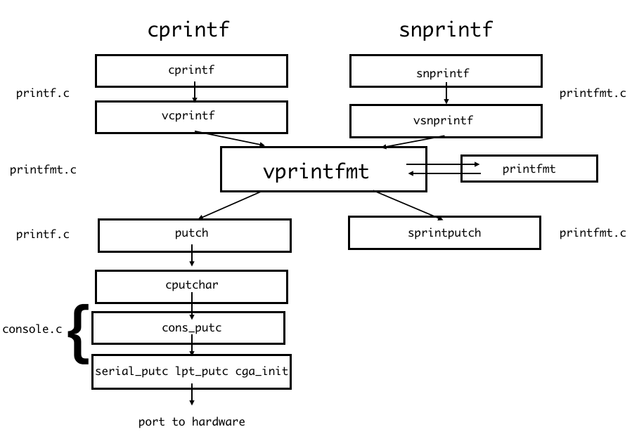

# Lab 1: Booting a PC

## Part1: PC Bootstrap

### Aboute assembly

- `Intel syntax -> NASM`
- `AT&T syntax  -> GNU`

- [Read](http://www.delorie.com/djgpp/doc/brennan/brennan_att_inline_djgpp.html) conversion between Intel & AT&T

A few note

> 1. **Source/Destination Ordering**
>
>    load **ebx** with the value in **eax**:
>
>    ```assembly
>    AT&T:  movl %eax, %ebx
>    ```
>
> 2. **Constant value/immediate value format:**
>
>    ```assembly
>    AT&T:  movl $_booga, %eax
>    AT&T:  movl $0xd00d, %ebx
>    ```
>
> 3. **Referencing memory:**
>
>    ```
>    AT&T:  immed32(basepointer,indexpointer,indexscale)
>    ```
>
>    $immed32 + basepointer + indexpointer * indexscale$
>
> 4. **Watcom-like extensions Inline ASM**
>
>    ```c
>    asm ( "statements" : output_registers : input_registers : clobbered_registers);
>    ```
>
>    ```c
>    asm ("cld\n\t"
>         "rep\n\t"
>         "stosl"
>         : /* no output registers */
>         : "c" (count), "a" (fill_value), "D" (dest)
>         : "%ecx", "%edi" );
>    ```
>
>    Here we load **ecx** with **count**, **eax** with **fill_value**, and **edi** with **dest**. Why make GCC do it instead of doing it ourselves? Because GCC, in its register allocating, might be able to arrange for, say, **fill_value** to already be in **eax**. If this is in a loop, it might be able to preserve **eax** thru the loop, and save a **movl** once per loop.
>
>    **clobberlist** means GCC can not count on the values which have stored in these registers before Inline ASM.
>
>    ```assembly
>    a        eax
>    b        ebx
>    c        ecx
>    d        edx
>    S        esi
>    D        edi
>    I        constant value (0 to 31)
>    q,r      dynamically allocated register (see below)
>    g        eax, ebx, ecx, edx or variable in memory
>    A        eax and edx combined into a 64-bit integer (use long longs)
>    ```
>
>    ```c
>    asm ("leal (%1,%1,4), %0"
>         : "=r" (x_times_5)
>         : "0" (x));
>    ```
>
>    The above example multiplies x by 5 really quickly (1 cycle on the Pentium). Now, we could have specified, say **eax**. But unless we really need a specific register (like when using **rep movsl** or **rep stosl**, which are hardcoded to use **ecx**, **edi**, and **esi**), why not let GCC pick an available one? So when GCC generates the output code for GAS, %0 will be replaced by the register it picked.
>
>    And where did **"q"** and **"r"** come from? Well, **"q"** causes GCC to allocate from **eax**, **ebx**, **ecx**, and **edx**. **"r"** lets GCC also consider **esi** and **edi**. So make sure, if you use **"r"** that it would be possible to use **esi** or **edi** in that instruction. If not, use **"q"**.
>
>    Note the use of **=** to specify an output register. You just have to do it that way. If you want 1 variable to stay in 1 register for both in and out, you have to respecify the register allocated to it on the way in with the **"0"** type codes as mentioned above.
>
> 5. **Important note:** If your assembly statement *must* execute where you put it, (i.e. must not be moved out of a loop as an optimization), put the keyword **volatile** after **asm** and before the ()'s. To be ultra-careful, use`__asm__ __volatile__ (...whatever...);`

### Some useful examples about inline

```assembly
#define disable() asm volatile ("cli");
#define enable() asm volatile ("sti");
#define times3(arg1, arg2) \
__asm__ ( \
  "leal (%0,%0,2),%0" \
  : "=r" (arg2) \
  : "0" (arg1) );

#define times5(arg1, arg2) \
__asm__ ( \
  "leal (%0,%0,4),%0" \
  : "=r" (arg2) \
  : "0" (arg1) );

#define times9(arg1, arg2) \
__asm__ ( \
  "leal (%0,%0,8),%0" \
  : "=r" (arg2) \
  : "0" (arg1) );
  
#define rep_movsl(src, dest, numwords) \
__asm__ __volatile__ ( \
  "cld\n\t" \
  "rep\n\t" \
  "movsl" \
  : : "S" (src), "D" (dest), "c" (numwords) \
  : "%ecx", "%esi", "%edi" )

#define rep_stosl(value, dest, numwords) \
__asm__ __volatile__ ( \
  "cld\n\t" \
  "rep\n\t" \
  "stosl" \
  : : "a" (value), "D" (dest), "c" (numwords) \
  : "%ecx", "%edi" )

#define RDTSC(llptr) ({ \
__asm__ __volatile__ ( \
        ".byte 0x0f; .byte 0x31" \
        : "=A" (llptr) \
        : : "eax", "edx"); })
```

### Physical Address Space

```c

+------------------+  <- 0xFFFFFFFF (4GB)
|      32-bit      |
|  memory mapped   |
|     devices      |
|                  |
/\/\/\/\/\/\/\/\/\/\

/\/\/\/\/\/\/\/\/\/\
|                  |
|      Unused      |
|                  |
+------------------+  <- depends on amount of RAM
|                  |
|                  |
| Extended Memory  |
|                  |
|                  |
+------------------+  <- 0x00100000 (1MB)
|     BIOS ROM     |
+------------------+  <- 0x000F0000 (960KB)
|  16-bit devices, |
|  expansion ROMs  |
+------------------+  <- 0x000C0000 (768KB)
|   VGA Display    |
+------------------+  <- 0x000A0000 (640KB)
|                  |
|    Low Memory    |
|                  |
+------------------+  <- 0x00000000
```

In addition, some space at the very top of the PC's 32-bit physical address space, above all physical RAM, is now commonly reserved by the BIOS for use by 32-bit PCI devices.

### Bios

```assembly
[f000:fff0] 0xffff0:	ljmp   $0xf000,$0xe05b
```

The IBM PC starts executing at physical address 0x000ffff0, which is at the very top of the 64KB area reserved for the ROM BIOS.


## Part 2: Boot Loader

- When the BIOS finds a bootable floppy or hard disk, it loads the 512-byte boot sector into memory at physical addresses `0x7c00 through 0x7dff`, and then uses a `jmp` instruction to set the CS:IP to `0000:7c00`, passing control to the boot loader.
- The boot loader consists of one assembly language source file, `boot/boot.S`, and one C source file, `boot/main.c`

`boot.S`与`TSU ucore`的一样，这部分实现的功能都一样，将（`ucore`当时写的代码带注释的放上来）

```assembly
#include <asm.h>

# Start the CPU: switch to 32-bit protected mode, jump into C.
# 开启CPU 最先开始是在i8086(16位)实模式运行，bootloader将其切换至32位的i80386的32位保护模式 最后交给kernel
# The BIOS loads this code from the first sector of the hard disk into
# memory at physical address 0x7c00 and starts executing in real mode
# with %cs=0 %ip=7c00.
# BIOS将从硬盘中的第一个扇区读取这些代码
# 将这些代码放在物理内存中的0x7c00处并开始执行
# 此时是实模式，cs寄存器是0 ip寄存器是7c00
# 内核代码段选择子
.set PROT_MODE_CSEG,        0x8                     # kernel code segment selector
# 内核数据段选择子
.set PROT_MODE_DSEG,        0x10                    # kernel data segment selector
# 保护模式flag
.set CR0_PE_ON,             0x1                     # protected mode enable flag

# start address should be 0x7c00, in real mode, the beginning address of the running bootloader
.globl start
start:
.code16                                             # Assemble for 16-bit mode
    cli                                             # Disable interrupts 关闭中断
    cld                                             # String operations increment

    # Set up the important data segment registers (DS, ES, SS).
    # 将段寄存器置0 ds = 0 es = 0 ss = 0
    xorw %ax, %ax                                   # Segment number zero
    movw %ax, %ds                                   # -> Data Segment
    movw %ax, %es                                   # -> Extra Segment
    movw %ax, %ss                                   # -> Stack Segment

    # Enable A20:
    # 开启A20(修改A20地址线)
    # 为了兼容老的机器 IBM在硬件上添加硬件逻辑，实现回绕的特性 这就是A20gate
    #  For backwards compatibility with the earliest PCs, physical
    #  address line 20 is tied low, so that addresses higher than
    #  1MB wrap around to zero by default. This code undoes this.
    # 向键盘控制器8042发送一个命令，将输出引置高电平 作为A20的输入(见附录)
seta20.1:
    inb $0x64, %al                                  # Wait for not busy(8042 input buffer empty).等待8042的输入缓冲区为空 (不忙)
    testb $0x2, %al
    jnz seta20.1

    movb $0xd1, %al                                 # 0xd1 -> port 0x64 
    outb %al, $0x64                                 # 0xd1 means: write data to 8042's P2 port 发送写指令

seta20.2:
    inb $0x64, %al                                  # Wait for not busy(8042 input buffer empty).等待8042的输入缓冲区为空 (不忙)
    testb $0x2, %al
    jnz seta20.2

    movb $0xdf, %al                                 # 0xdf -> port 0x60
    outb %al, $0x60                                 # 0xdf = 11011111, means set P2's A20 bit(the 1 bit) to 1 打开A20

    # Switch from real to protected mode, using a bootstrap GDT
    # and segment translation that makes virtual addresses
    # identical to physical addresses, so that the
    # effective memory map does not change during the switch.
    # 初始化GDT表 将GDT的其实地址保存在GDTR寄存器中
    lgdt gdtdesc
    
    # 将cr0寄存器中的PE位置置1开启保护模式
    movl %cr0, %eax
    orl $CR0_PE_ON, %eax
    movl %eax, %cr0

    # Jump to next instruction, but in 32-bit code segment. 
    # 跳转到下条指令，但是是在32位的代码段
    # Switches processor into 32-bit mode.
    # 使processor切换至32位
    # 长跳的格式是：段选择子，段内偏移
    ljmp $PROT_MODE_CSEG, $protcseg
	# 这里的Code SEG 为0x0 接着下面
.code32                                             # Assemble for 32-bit mode
protcseg:
    # Set up the protected-mode data segment registers
    # 开始设置保护模式的段寄存器
    movw $PROT_MODE_DSEG, %ax                       # Our data segment selector
    movw %ax, %ds                                   # -> DS: Data Segment
    movw %ax, %es                                   # -> ES: Extra Segment
    movw %ax, %fs                                   # -> FS: 辅助寄存器
    movw %ax, %gs                                   # -> GS
    # 设置stack
    movw %ax, %ss                                   # -> SS: Stack Segment
    # 设置栈的栈底和栈顶指针
    # 初始的栈底指针为0x0
    # 初始的栈顶指针为0x7c00
    # Set up the stack pointer and call into C. 
    # The stack region is from 0--start(0x7c00)
    movl $0x0, %ebp
    movl $start, %esp
    # 移动到bootmain
    call bootmain
    # 如果bootmain返回了，就在下面循环
    # If bootmain returns (it shouldn't), loop.
spin:
    jmp spin

# Bootstrap GDT 
# GDT表和描述符见下 详细内容见asm.h
.p2align 2                                          # force 4 byte alignment
gdt:
	# 全局变量描述符表第一个段描述符表设定为空
    SEG_NULLASM                                     # null seg
    SEG_ASM(STA_X|STA_R, 0x0, 0xffffffff)           # code seg for bootloader and kernel
    SEG_ASM(STA_W, 0x0, 0xffffffff)                 # data seg for bootloader and kernel

gdtdesc:
	# 类似于消息头 告诉gdt的大小
    .word 0x17                                      # sizeof(gdt) - 1
    # GDT的地址
    .long gdt                                       # address gdt
```

 `boot.S`与`ucore`不同的地方在于其没有设置栈顶与栈底指针。

```c
#ifdef __ASSEMBLER__

/*
 * Macros to build GDT entries in assembly.
 */
#define SEG_NULL						\
	.word 0, 0;						\
	.byte 0, 0, 0, 0
#define SEG(type,base,lim)					\
	.word (((lim) >> 12) & 0xffff), ((base) & 0xffff);	\
	.byte (((base) >> 16) & 0xff), (0x90 | (type)),		\
		(0xC0 | (((lim) >> 28) & 0xf)), (((base) >> 24) & 0xff)

#else	// not __ASSEMBLER__
```

对于`GDT`中的表项，利用宏函数把参数放到合适的位置。

`bootmain`也非常一致

```c
#include <defs.h> //包括inb和outb 用pio
#include <x86.h>
#include <elf.h> //包括了elf头和程序头

/* *********************************************************************
 * This a dirt simple boot loader, whose sole job is to boot
 * an ELF kernel image from the first IDE hard disk.
 * 这个boot loader的作用就是把ELF格式的kernel镜像从连接的第一个硬盘中加载
 *
 * DISK LAYOUT
 *  * This program(bootasm.S and bootmain.c) is the bootloader.
 *    It should be stored in the first sector of the disk.
 *  * 这个文件和bootasm.s一起构成的boot loader 其必须小于512字节
 *
 *  * The 2nd sector onward holds the kernel image.
 *  * hard disk的第二个扇区保存着kernel的image
 *
 *  * The kernel image must be in ELF format.
 *  * kernel的镜像必须是以elf的格式保存的
 *
 * BOOT UP STEPS
 *  * when the CPU boots it loads the BIOS into memory and executes it
 *  * CPU boots 加载bios并运行
 *
 *  * the BIOS initializes devices, sets of the interrupt routines, and
 *    reads the first sector of the boot device(e.g., hard-drive)
 *    into memory and jumps to it.
 *   *BIOS 初始化硬件 设置中断模式 从bootdevice中读取第一个扇区到内存中 并跳到这个区域
 *
 *  * Assuming this boot loader is stored in the first sector of the
 *    hard-drive, this code takes over...
 *  * 然后就到了boot loader中间了
 *
 *  * control starts in bootasm.S -- which sets up protected mode,
 *    and a stack so C code then run, then calls bootmain()
 *  * 首先跳的是的bootasm的内容 其设置了保护态 关闭了中断 设置了堆栈（使c可以跑起来，esp又是7c00）
 *  * 然后call了bootmain 开始执行c的内容
 *
 *  * bootmain() in this file takes over, reads in the kernel and jumps to it.
 *  * 这就到了bootmain 这个程序就是读那个kernel 然后跳到那里
 * */

#define SECTSIZE        512 //每个扇区都是512字节
#define ELFHDR          ((struct elfhdr *)0x10000)      // 把头放在这里

/** 从defs.h include进来的函数
 * inb(port) 从端口读入一字节的内容 利用内联汇编 port表见2.3.2.3
 * outb(port,data) 写data到port
 * insl(port,*addr,cnt) 从io端口中记录了的地址上（调用之前写入） 读取cnt个dw
 */

/* waitdisk - wait for disk ready
 * 等待硬盘准备
 */
static void waitdisk(void) {
    while ((inb(0x1F7) & 0xC0) != 0x40)
        /* do nothing */;
}

/* readsect - read a single sector at @secno into @dst
 * 读取一个扇区
 * 从secno读取到dst
 */
static void
readsect(void *dst, uint32_t secno) {
    // wait for disk to be ready
    waitdisk();

    //下面内容参考2.3.2.3的表的内容
    outb(0x1F2, 1);                         // count = 1 表明要读一个扇区
    //根据协议将要读的LBA写到port上
    outb(0x1F3, secno & 0xFF);
    outb(0x1F4, (secno >> 8) & 0xFF);
    outb(0x1F5, (secno >> 16) & 0xFF);
    outb(0x1F6, ((secno >> 24) & 0xF) | 0xE0); //第四位为0主盘
    //给命令 要求读 不忙的时候就从0x1F0把内容丢过来
    outb(0x1F7, 0x20);                      // cmd 0x20 - read sectors
    // wait for disk to be ready
    waitdisk();
    //从0x1F0把内容读进来 见insl函数 然而是32bit (4个bytes) 读入 所以 sectsize要除4
    // read a sector
    insl(0x1F0, dst, SECTSIZE / 4);
}

/* *
 * readseg - read @count bytes at @offset from kernel into virtual address @va,
 * might copy more than asked.
 * 利用readsect 可以读取任意长度的内容
 * 从offset开始读count个bytes放在va中
 * 由于readsect 是一次读入一个扇区的 所以读进来的可能比要求的更多
 * */
static void readseg(uintptr_t va, uint32_t count, uint32_t offset) {
    uintptr_t end_va = va + count;

    // round down to sector boundary
    va -= offset % SECTSIZE;
    // translate from bytes to sectors; kernel starts at sector 1 从1号扇区开始
    uint32_t secno = (offset / SECTSIZE) + 1;

    // If this is too slow, we could read lots of sectors at a time.
    // We'd write more to memory than asked, but it doesn't matter --
    // we load in increasing order.
    for (; va < end_va; va += SECTSIZE, secno ++) {
        readsect((void *)va, secno);
    }
}

/* bootmain - the entry of bootloader */
void
bootmain(void) {
    // read the 1st page off disk
	// 将ELF的头读进来 还有包括了Prog的头
    readseg((uintptr_t)ELFHDR, SECTSIZE * 8, 0);

    // 判断是否为合法的ELF
    // is this a valid ELF?
    if (ELFHDR->e_magic != ELF_MAGIC) {
        goto bad;
    }

    struct proghdr *ph, *eph;

    // load each program segment (ignores ph flags)
    // 加载每一个程序段
    ph = (struct proghdr *)((uintptr_t)ELFHDR + ELFHDR->e_phoff);
  	//elf头加上prog头偏移地址就找了prog头
    eph = ph + ELFHDR->e_phnum;
  	//这个地址后面一共跟了e_phnum个prog头的地址
    for (; ph < eph; ph ++) {
        readseg(ph->p_va & 0xFFFFFF, ph->p_memsz, ph->p_offset);
      	//将一个程序 读到他的头声明的地方
    }
  
    // call the entry point from the ELF header
    // note: does not return
    // 可以去kernel了 执行kernel的入口地址
    ((void (*)(void))(ELFHDR->e_entry & 0xFFFFFF))();

bad:
    outw(0x8A00, 0x8A00);
    outw(0x8A00, 0x8E00);

    /* do nothing */
    while (1);
}
```

`boot.s`中不同的算法

```c
//round down in ucore
va -= offset % SECTSIZE;
//round down in jos
pa &= ~(SECTSIZE - 1);
```

`main`在`0x7d13`

`ELFHDR`分布如图


```c
/* file header */
/* ELF 的文件头 */
struct elfhdr {
    uint32_t e_magic;     // must equal ELF_MAGIC 通过判断该内容 知道时候是我们要找的elf文件
    uint8_t e_elf[12];
    uint16_t e_type;      // 1=relocatable, 2=executable, 3=shared object, 4=core image elf的类型
    uint16_t e_machine;   // 3=x86, 4=68K, etc. 运行机器的类型
    uint32_t e_version;   // file version, always 1 该elf的版本号
    uint32_t e_entry;     // entry point if executable kernel的入口地址
    uint32_t e_phoff;     // file position of program header or 0 program header的偏移地址/没有的话就为0
    uint32_t e_shoff;     // file position of section header or 0 section header的偏移地址/没有的话就为0
    uint32_t e_flags;     // architecture-specific flags, usually 0
    uint16_t e_ehsize;    // size of this elf header  elf head的大小
    uint16_t e_phentsize; // size of an entry in program header
    uint16_t e_phnum;     // number of entries in program header or 0
    uint16_t e_shentsize; // size of an entry in section header
    uint16_t e_shnum;     // number of entries in section header or 0
    uint16_t e_shstrndx;  // section number that contains section name strings
};

/* program section header */
/* 可执行文件的程序头 */
struct proghdr {
    uint32_t p_type;   // loadable code or data, dynamic linking info,etc. 类型
    uint32_t p_offset; // file offset of segment 段相对于文件头的偏移
    uint32_t p_va;     // virtual address to map segment
    uint32_t p_pa;     // physical address, not used
    uint32_t p_filesz; // size of segment in file 段在文件中的大小
    uint32_t p_memsz;  // size of segment in memory (bigger if contains bss） 段在内存中占用的字节数
    uint32_t p_flags;  // read/write/execute bits
    uint32_t p_align;  // required alignment, invariably hardware page size
};
```

- At what point does the processor start executing 32-bit code? What exactly causes the switch from 16- to 32-bit mode?

  After `long jump`

  Open A20 Gate, Load GDT(set GDTreg), and enable protected mode.

- What is the *last* instruction of the boot loader executed, and what is the *first* instruction of the kernel it just loaded?*Where* is the first instruction of the kernel?

  ```
  ((void (*)(void)) (ELFHDR->e_entry))();
  ```

  The `e_entry` in the ELF head.

  Acording to GDB, the first instruction is 

  ```assembly
  movw	$0x1234,0x472
  ```

  in `/kern/entry.S`.

  > \# '_start' specifies the ELF entry point.  Since we haven't set up
  >
  > \# virtual memory when the bootloader enters this code, we need the
  >
  > \# bootloader to jump to the *physical* address of the entry point.

  And `_start = RELOC(entry)`

  ```c
  #define	RELOC(x) ((x) - KERNBASE)
  ```

  In `memlayout.h`, we have defined this `KERNBASE`

  ```c
  // All physical memory mapped at this address
  #define	KERNBASE	0xF0000000
  ```

  And everything about memory layout are all in this header file! (Why the BASE is `0xF0000000`? Maybe that's about how the author design.)

  ```c

  /*
   * Virtual memory map:                                Permissions
   *                                                    kernel/user
   *
   *    4 Gig -------->  +------------------------------+
   *                     |                              | RW/--
   *                     ~~~~~~~~~~~~~~~~~~~~~~~~~~~~~~~~
   *                     :              .               :
   *                     :              .               :
   *                     :              .               :
   *                     |~~~~~~~~~~~~~~~~~~~~~~~~~~~~~~| RW/--
   *                     |                              | RW/--
   *                     |   Remapped Physical Memory   | RW/--
   *                     |                              | RW/--
   *    KERNBASE, ---->  +------------------------------+ 0xf0000000      --+
   *    KSTACKTOP        |     CPU0's Kernel Stack      | RW/--  KSTKSIZE   |
   *                     | - - - - - - - - - - - - - - -|                   |
   *                     |      Invalid Memory (*)      | --/--  KSTKGAP    |
   *                     +------------------------------+                   |
   *                     |     CPU1's Kernel Stack      | RW/--  KSTKSIZE   |
   *                     | - - - - - - - - - - - - - - -|                 PTSIZE
   *                     |      Invalid Memory (*)      | --/--  KSTKGAP    |
   *                     +------------------------------+                   |
   *                     :              .               :                   |
   *                     :              .               :                   |
   *    MMIOLIM ------>  +------------------------------+ 0xefc00000      --+
   *                     |       Memory-mapped I/O      | RW/--  PTSIZE
   * ULIM, MMIOBASE -->  +------------------------------+ 0xef800000
   *                     |  Cur. Page Table (User R-)   | R-/R-  PTSIZE
   *    UVPT      ---->  +------------------------------+ 0xef400000
   *                     |          RO PAGES            | R-/R-  PTSIZE
   *    UPAGES    ---->  +------------------------------+ 0xef000000
   *                     |           RO ENVS            | R-/R-  PTSIZE
   * UTOP,UENVS ------>  +------------------------------+ 0xeec00000
   * UXSTACKTOP -/       |     User Exception Stack     | RW/RW  PGSIZE
   *                     +------------------------------+ 0xeebff000
   *                     |       Empty Memory (*)       | --/--  PGSIZE
   *    USTACKTOP  --->  +------------------------------+ 0xeebfe000
   *                     |      Normal User Stack       | RW/RW  PGSIZE
   *                     +------------------------------+ 0xeebfd000
   *                     |                              |
   *                     |                              |
   *                     ~~~~~~~~~~~~~~~~~~~~~~~~~~~~~~~~
   *                     .                              .
   *                     .                              .
   *                     .                              .
   *                     |~~~~~~~~~~~~~~~~~~~~~~~~~~~~~~|
   *                     |     Program Data & Heap      |
   *    UTEXT -------->  +------------------------------+ 0x00800000
   *    PFTEMP ------->  |       Empty Memory (*)       |        PTSIZE
   *                     |                              |
   *    UTEMP -------->  +------------------------------+ 0x00400000      --+
   *                     |       Empty Memory (*)       |                   |
   *                     | - - - - - - - - - - - - - - -|                   |
   *                     |  User STAB Data (optional)   |                 PTSIZE
   *    USTABDATA ---->  +------------------------------+ 0x00200000        |
   *                     |       Empty Memory (*)       |                   |
   *    0 ------------>  +------------------------------+                 --+
   *
   * (*) Note: The kernel ensures that "Invalid Memory" is *never* mapped.
   *     "Empty Memory" is normally unmapped, but user programs may map pages
   *     there if desired.  JOS user programs map pages temporarily at UTEMP.
   */
  ```

  ​

- How does the boot loader decide how many sectors it must read in order to fetch the entire kernel from disk? Where does it find this information?

  In ELF header, there is an argument called `e_phnum`, which reveal the number of proc. And in the stucture of `proc`，`p_memsz` reveal the exact size of each proc.

### Exercise 4

[pointers.c](https://pdos.csail.mit.edu/6.828/2016/labs/lab1/pointers.c)

```c
#include <stdio.h>
#include <stdlib.h>

void
f(void){
    int a[4];
    int *b = malloc(16);
    int *c;
    int i;

    printf("1: a = %p, b = %p, c = %p\n", a, b, c);

    c = a;
    for (i = 0; i < 4; i++)
	    a[i] = 100 + i;
    //  a:   0   1   2   3
    //val:  100 101 102 103
    c[0] = 200;
    //  a:   0   1   2   3
    //val:  200 101 102 103
    printf("2: a[0] = %d, a[1] = %d, a[2] = %d, a[3] = %d\n",
	   a[0], a[1], a[2], a[3]);

    c[1] = 300;
    *(c + 2) = 301;
    3[c] = 302;
    //  a:   0   1   2   3
    //val:  200 300 301 302
    printf("3: a[0] = %d, a[1] = %d, a[2] = %d, a[3] = %d\n",
	   a[0], a[1], a[2], a[3]);

    c = c + 1;
    *c = 400;
    //  a:   0   1   2   3
    //val:  200 400 301 302
    printf("4: a[0] = %d, a[1] = %d, a[2] = %d, a[3] = %d\n",
	   a[0], a[1], a[2], a[3]);

    c = (int *) ((char *) c + 1);
    *c = 500;
    // 500 = 0x0000_01F4
    // in machine F4 01 00 00
    // 400 = 0x0000_0190
    // in machine 90 01 00 00
    // a[1] in machine 90 F4 01 00
    // a[1] = 0x0001_F490
    // a[1] = 128144
    // 301 = 0x0000_012D
    // in machine 2D 01 00 00
    // a[2] in machine 00 01 00 00
    // a[2] = 256
    //  a:   0     1    2   3
    //val:  200 128144 256 302
    printf("5: a[0] = %d, a[1] = %d, a[2] = %d, a[3] = %d\n",
	   a[0], a[1], a[2], a[3]);


    b = (int *) a + 1;
    c = (int *) ((char *) a + 1);
    //1: a = 0x7fff578ab940, b = 0x7ff1a7402670, c = 0x100000000
    //a = a b = a + 4 c = a + 1
    printf("6: a = %p, b = %p, c = %p\n", a, b, c);
}

int
main(int ac, char **av)
{
    f();
    return 0;
}

```

### ELF文件中各段

> BSS段通常是指用来存放程序中未初始化的全局变量和静态变量的一块内存区域。特点是可读写的，在程序执行之前BSS段会自动清0。
>
> 可执行程序包括BSS段、数据段、代码段（也称文本段）

```shell
Sections:
Idx Name          Size      VMA       LMA       File off  Algn
  0 .text         00001871  f0100000  00100000  00001000  2**4
                  CONTENTS, ALLOC, LOAD, READONLY, CODE
  1 .rodata       00000714  f0101880  00101880  00002880  2**5
                  CONTENTS, ALLOC, LOAD, READONLY, DATA
  2 .stab         000038d1  f0101f94  00101f94  00002f94  2**2
                  CONTENTS, ALLOC, LOAD, READONLY, DATA
  3 .stabstr      000018bb  f0105865  00105865  00006865  2**0
                  CONTENTS, ALLOC, LOAD, READONLY, DATA
  4 .data         0000a300  f0108000  00108000  00009000  2**12
                  CONTENTS, ALLOC, LOAD, DATA
  5 .bss          00000644  f0112300  00112300  00013300  2**5
                  ALLOC
  6 .comment      00000034  00000000  00000000  00013300  2**0
                  CONTENTS, READONLY

```

> Take particular note of the "VMA" (or *link address*) and the "LMA" (or *load address*) of the `.text` section. The load address of a section is the memory address at which that section should be loaded into memory.

### Exercise 6

Reset the machine (exit QEMU/GDB and start them again). Examine the 8 words of memory at 0x00100000 at the point the BIOS enters the boot loader, and then again at the point the boot loader enters the kernel. Why are they different? What is there at the second breakpoint? (You do not really need to use QEMU to answer this question. Just think.)

开启保护模式之前地址空间是`0x00000~0xfffff`

## Part 3: The Kernel

> Operating system kernels often like to be linked and run at very high *virtual address*, such as 0xf0100000, in order to leave the lower part of the processor's virtual address space for user programs to use

Once `CR0_PG` is set, memory references are virtual addresses that get translated by the virtual memory hardware to physical addresses. `entry_pgdir`translates virtual addresses in the range `0xf0000000` through `0xf0400000` to physical addresses `0x00000000` through `0x00400000`, as well as virtual addresses` 0x00000000` through` 0x00400000 `to physical addresses `0x00000000 `through `0x00400000`

```assembly
movw	$0x1234,0x472			# warm boot
```

> warm boot：即告诉BIOS检测程序“不要做内存检测”。该子程序往物理内存地址0x472处写值0x1234。该位置是启动模式（reboot_mode）标志字。在启动过程中ROM BIOS会读取该启动模式标志值并根据其值来指导下一步的执行。 如果该值是0x1234，则BIOS 就会跳过内存检测过程而执行热启动（Warm-boot）过程。 如果若该值为0，则执行冷启动（Cold-boot）过程。

对于这块的理解，我在注释中说清楚了

```assembly
entry:
	movw	$0x1234,0x472			# warm boot

	# We haven't set up virtual memory yet, so we're running from
	# the physical address the boot loader loaded the kernel at: 1MB
	# (plus a few bytes).  However, the C code is linked to run at
	# KERNBASE+1MB.  Hence, we set up a trivial page directory that
	# translates virtual addresses [KERNBASE, KERNBASE+4MB) to
	# physical addresses [0, 4MB).  This 4MB region will be
	# sufficient until we set up our real page table in mem_init
	# in lab 2.

	# Load the physical address of entry_pgdir into cr3.  entry_pgdir
	# is defined in entrypgdir.c.
	movl	$(RELOC(entry_pgdir)), %eax
	movl	%eax, %cr3
	# Turn on paging.
	movl	%cr0, %eax
	orl	$(CR0_PE|CR0_PG|CR0_WP), %eax
	movl	%eax, %cr0

	# Now paging is enabled, but we're still running at a low EIP
	# (why is this okay?).  Jump up above KERNBASE before entering
	# C code.
	# At first: As for entry, we have used RELOC(entry) which will
	# minus KERNBASE. So the value will be 0x100000+OFFSET. (As we
	# have defined . = 0xF0100000 SO $entry = 0xF0100000 + OFFSET)
	# And ".text:AT(0x100000)" gives the load address of this section.
	# So we can run exactly the code above 'relocated'.
	# Second  : As for jmp *%eax. %eax = 0xF0100000+OFFSET and scince
	# we have mapped 0xF0000000~0xF0400000 to 0x0~0x400000, the virtual
	# address 0xF0100000+OFFSET point to physical address 0x100000+OFFSET,
	# which are exactly where our codes lays.
	mov	$relocated, %eax
	jmp	*%eax
relocated:
```

### Exercise 7

What is the first instruction *after* the new mapping is established that would fail to work properly if the mapping weren't in place? Comment out the `movl %eax, %cr0` in`kern/entry.S`, trace into it, and see if you were right.

`jmp`，原因上面我的注释说很清楚了。

**页表设置那个骚操作还没搞清楚!! [x] `entry_pgdir`  **

`JOS`到这里才正式初始化栈

```assembly
	# Clear the frame pointer register (EBP)
	# so that once we get into debugging C code,
	# stack backtraces will be terminated properly.
	movl	$0x0,%ebp			# nuke frame pointer

	# Set the stack pointer
	movl	$(bootstacktop),%esp
	

.data
###################################################################
# boot stack
###################################################################
	.p2align	PGSHIFT		# force page alignment
	.globl		bootstack
bootstack:
	.space		KSTKSIZE
	.globl		bootstacktop   
bootstacktop:
```


### Formatted Printing to the Console

`ucore`对于这个部分没有关注

#### `console.c`

##### 先只关注其中与`put_c`有关的

- 最底层的是:

  - `serial_putc` 串口输出，（与串口协议有关）
  - `lpt_putc` 并口输出
  - `cga_init` 屏幕输出

  对于串口和并口，直接将数据根据协议丢到对应的端口就好了。

  对于屏幕输出，

  > 终于弄懂为啥`\r\n`了。`\n`只是直接向下一行，而`\r\n`是先回到第一个字符再向下一行。

  ```c
  static void
  cga_putc(int c)
  {
  	// if no attribute given, then use black on white
  	if (!(c & ~0xFF))
  		c |= 0x0700;

  	switch (c & 0xff) {
  	case '\b': /* backspace */
  		if (crt_pos > 0) {
  			crt_pos--;
  			// delete the character
  			crt_buf[crt_pos] = (c & ~0xff) | ' ';
  		}
  		break;
  	case '\n':	/* new line */
  		crt_pos += CRT_COLS;
  		/* fallthru */
  	case '\r': /* return to the first character of cur line */
  		crt_pos -= (crt_pos % CRT_COLS);
  		break;
  	case '\t':
  		cons_putc(' ');
  		cons_putc(' ');
  		cons_putc(' ');
  		cons_putc(' ');
  		cons_putc(' ');
  		break;
  	default:
  		crt_buf[crt_pos++] = c;		/* write the character */
  		break;
  	}

  	// When current pos reach the bottom of the creen
  	// case '\n' : crt_pos -= CRT_COLS will work
  	// case other: crt_pos must equal to CRT_SIZE 
  	if (crt_pos >= CRT_SIZE) {
  		int i;
  		// Move all the screen upward (a line)
  		memmove(crt_buf, crt_buf + CRT_COLS, (CRT_SIZE - CRT_COLS) * sizeof(uint16_t));
  		// Clear the bottom line
  		for (i = CRT_SIZE - CRT_COLS; i < CRT_SIZE; i++)
  			crt_buf[i] = 0x0700 | ' ';
  		crt_pos -= CRT_COLS;
  	}

  	/* move that little blinky thing */
  	outb(addr_6845, 14);
  	outb(addr_6845 + 1, crt_pos >> 8);
  	outb(addr_6845, 15);
  	outb(addr_6845 + 1, crt_pos);
  }
  ```

- 这三个打包成`cons_putc`，作为`console`抽象的中间层

- 高层次接口`cputchar`则是直接调用`cons_putc`

##### 再关心`getc`

首先说思路，这直接用`buf`做一个循环缓存。中间有两个`pointer`，指向了读和写的位置。正常中断时是写入到缓存中，而读是从缓存中读出来一个。

- 当中断关闭时

  主动向端口询问是否有输入数据，如果有就处理。如果没有就循环等待。

- 当中断开启时

  理论上应该是直接往`buf`中写东西。`console`里面没有涉及到。


这次从高到底。

- 高层次`getchar`，直接调抽象层`cons_getc`，如果没有输入就循环等待。

- 抽象层`cons_getc`

  主动询问串口与键盘，查看是否有新的输入，并进行填充。(顺序串口->键盘，不等待)。并从`buf`中返回最远的没有读的字符。

- 各个串口，键盘的主动询问

  ```c
  static int
  kbd_proc_data(void)
  {
  	int c;
  	uint8_t stat, data;
  	static uint32_t shift;

  	stat = inb(KBSTATP);
  	if ((stat & KBS_DIB) == 0)
  		return -1;
  	// Ignore data from mouse.
  	if (stat & KBS_TERR)
  		return -1;

  	data = inb(KBDATAP);

  	if (data == 0xE0) {
  		// E0 escape character
  		// which means there will be another character wait to be accept
  		shift |= E0ESC;
  		return 0;
  	} else if (data & 0x80) {
  		// Key released
  		// shift should be unmarked
  		data = (shift & E0ESC ? data : data & 0x7F);
  		shift &= ~(shiftcode[data] | E0ESC);
  		return 0;
  	} else if (shift & E0ESC) {
  		// Last character was an E0 escape; or with 0x80
  		// the second character
  		data |= 0x80;
  		shift &= ~E0ESC;
  	}

  	shift |= shiftcode[data];
  	// type function keys will turn on/off when off/on
  	shift ^= togglecode[data];
  	// can add CTL+ALT table
  	c = charcode[shift & (CTL | SHIFT)][data];
  	if (shift & CAPSLOCK) {
  		if ('a' <= c && c <= 'z')
  			c += 'A' - 'a';
  		else if ('A' <= c && c <= 'Z')
  			c += 'a' - 'A';
  	}

  	// Process special keys
  	// Ctrl-Alt-Del: reboot
  	if (!(~shift & (CTL | ALT)) && c == KEY_DEL) {
  		cprintf("Rebooting!\n");
  		outb(0x92, 0x3); // courtesy of Chris Frost
  	}

  	return c;
  }
  ```

  键盘的输入处理比较精妙。用了以下技巧：

  - 标记位位操作，控制标记`ctl shift`等键是否按下
  - 表偏移，根据按下的`ctl shift`等键，偏移到不同的表去查找对应的字符

#### `printfmt.c`

作为抽象层接口，其不直接与底层接口接入。先看整理的关系图



其中最重要的就是`vprintfmt`，作为抽象接口，其可以根据传入的函数指针打印到不同的对象。对于打印到屏幕来说，就是调用`putch`到底层驱动串口和显示器。对于打印到字符串，则利用`sprintpuch`将单个字符保存到字符串。

读懂了代码填空就很简单了。

```c
		// (unsigned) octal
		case 'o':
			// Replace this with your code.
			num = getuint(&ap,lflag);
			base = 8;
			goto number;
			break;
```

顺便还添加了`%#`的功能

```c
	number:			
			// add alt function
			if(altflag){
				switch(base){
					// %#o	0..
					case 8:
					putch('0',putdat);
					break;

					// %#x 0x..
					case 16:
					putch('0',putdat);
					putch('x',putdat);
					break;
				}
			}
```

他写的`%-`与常理也不同

```
		// flag to pad on the right
		// "%-5d",1 -> "----1"
		// in normal c "1    "
		case '-':
			padc = '-';
			goto reswitch;
```

所以也改了一下

```c
/*
 * Print a number (base <= 16) in reverse order,
 * using specified putch function and associated pointer putdat.
 */
static void
printnum_recu(void (*putch)(int, void*), void *putdat,
	 unsigned long long num, unsigned base, int* width, int padc)
{
	// first recursively print all preceding (more significant) digits
	if (num >= base) {
		(*width)--;
		printnum_recu(putch, putdat, num / base, base, width, padc);
	} else if(padc != '-'){
		// print any needed pad characters before first digit
		while (--(*width) > 0)
			putch(padc, putdat);
	}
	// then print this (the least significant) digit
	putch("0123456789abcdef"[num % base], putdat);
}

static void
printnum(void (*putch)(int, void*), void *putdat,
	 unsigned long long num, unsigned base, int width, int padc)
{
	int numlen = width;
	printnum_recu(putch,putdat,num,base,&numlen,padc);
	if(padc == '-'){
		width -= numlen;
		while(width-- > 0)
			putch(' ', putdat);
	}
}
```

可能还是不够优雅...


#### `printf.c`

最高层次抽象，提供其他程序可以用的接口。


#### Be able to answer the following questions: 

1. In the following code, what is going to be printed after `'y='`? (note: the answer is not a specific value.) Why does this happen?

   ```c
   cprintf("x=%d y=%d", 3);
   ```

   经典的`format attact`

2. Let's say that GCC changed its calling convention so that it pushed arguments on the stack in declaration order, so that the last argument is pushed last. How would you have to change `cprintf` or its interface so that it would still be possible to pass it a variable number of arguments?

   ```
   cprintf(...,"%d %d ...");
   ```

   反人类的设定..


Challenge Enhance the console to allow text to be printed in different colors. The traditional way to do this is to make it interpret [ANSI escape sequences](http://rrbrandt.dee.ufcg.edu.br/en/docs/ansi/) embedded in the text strings printed to the console, but you may use any mechanism you like. There is plenty of information on [the 6.828 reference page](https://pdos.csail.mit.edu/6.828/2016/reference.html) and elsewhere on the web on programming the VGA display hardware. If you're feeling really adventurous, you could try switching the VGA hardware into a graphics mode and making the console draw text onto the graphical frame buffer.

GUI最后再写，这里就不写了


## Stack

Exercise 9. Determine where the kernel initializes its stack, and exactly where in memory its stack is located. How does the kernel reserve space for its stack? And at which "end" of this reserved area is the stack pointer initialized to point to?

As I have mentioned above

```assembly
	# Clear the frame pointer register (EBP)
	# so that once we get into debugging C code,
	# stack backtraces will be terminated properly.
	movl	$0x0,%ebp			# nuke frame pointer

	# Set the stack pointer
	movl	$(bootstacktop),%esp
	

.data
###################################################################
# boot stack
###################################################################
	.p2align	PGSHIFT		# force page alignment
	.globl		bootstack
bootstack:
	.space		KSTKSIZE
	.globl		bootstacktop   
bootstacktop:
```

需要实现打印栈，没什么难度，`ucore`一样

```c
int
mon_backtrace(int argc, char **argv, struct Trapframe *tf)
{
	// Your code here.
	uint32_t ebp = read_ebp();
	uint32_t eip;
	uint32_t *args;
	uint32_t i;
	cprintf("Stack backtrace:\n");
	while(ebp!=0){
        eip = *((uint32_t *)ebp + 1);
        cprintf("  ebp %08x  eip %08x  args ", ebp, eip);
        args = (uint32_t *)ebp + 2;
		for( i = 0; i < 5; i++ )
            cprintf("%08x ", args[i]);
        cprintf("\n");
		ebp = *((uint32_t *)ebp);
	}
	return 0;
}
```


### 关于`.stab`

> stabs是用来做调试的信息，存储在符号表中。 名称来自symbol table entries。

下面主要讲个人理解

- `.stab`在`link`的时候生成，在生成`ELF`的时候写入了`ELF`，在`ELF`复制到内存的时候被复制到内存。

- 全局变量`STAB_BEGIN`与`STABSTR_BEGIN`在链接的时候设置了初值

  ```shell
  		PROVIDE(__STAB_BEGIN__ = .);
  		*(.stab);
  		PROVIDE(__STAB_END__ = .);
  		BYTE(0)		/* Force the linker to allocate space
  				   for this section */
  ```

- ```
  .stab N_SO   #file
  .stab N_FUN	 #function
  .stab N_FUN desc #targetline
  ```

  先找`file`，再找`function`，再找对应的那一行。

- 最后从`stabstr`中获取信息或者计算行数，传回。


## Q&A

Q：为何`QEMU`的窗口也有`output`

A：输出不仅输出到了`VGA`，同样输出到了`virtual serial port`

